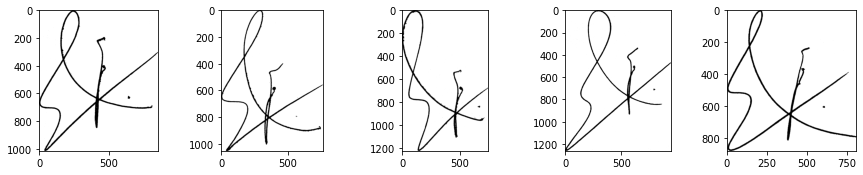
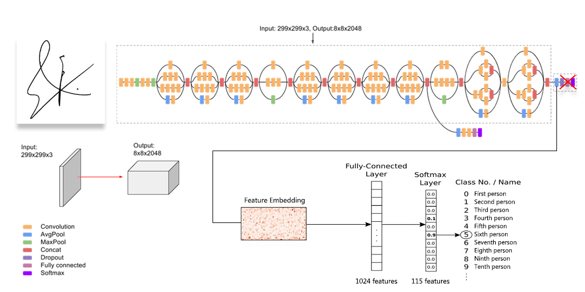
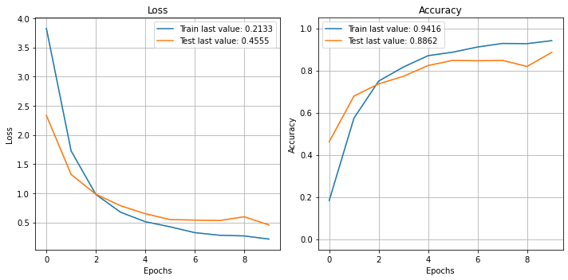

Signature verification has practical applications in various fields, particularly for security, legal, and financial purposes. Deep learning (DL) models have been proved to be promising in recognizing handwritten signatures, with high accuracy. In this expriment, we investigate the use of the InceptionV3, a pre-trained convolutional neural network (CNN), for signature classification.


{}
This project was done as part of the Pattern Recognition course at the Iran University of Science and Technology in the Fall of 2020.
{}

## Dataset
The dataset used for this project is called [UTSig](https://arxiv.org/abs/1603.03235), which consists of 115 classes, each belonging to one authentic person. There are 27 genuine signatures per class, 3 opposite-hand signed samples, and 42 simple forgeries. The dataset can be downloaded [from here](https://drive.google.com/drive/u/1/folders/0B0CjHfsXJLLObEZFNVdoMlFIODg).



To start the implementation, the dataset is downloaded and stored in the Google Drive. The genuine signatures were divided into 22 training images and 5 test images for each person and placed in the appropriate subdirectorie.

```python
!unzip '/content/drive/MyDrive/UTSig.zip'
```

```python
dataset_path = '/content/UTSig_Crop/'
# Number of genuine signatures per class (person)
G_num = 27
# Number of forgeries signatures per class (person)
F_num = 45
# Number of classes (persons)
c_num = 115
os.mkdir(dataset_path + 'genuine')
os.mkdir(dataset_path + 'genuine/train')
os.mkdir(dataset_path + 'genuine/test')
dataset_gen_path = dataset_path + 'genuine/'
```

## Organizing the Dataset
We organized the images into the appropriate format for the `ImageDataGenerator`. We created subdirectories for each class in the genuine directory, with 22 images for training and 5 images for testing per class.

* genuine
  * train
    * class_0
      * 0_image_0.png
      * 0_image_1.png
      * ...
      * 0_image_21.png
    * class_1
    * ...
    * class_114
  * test
    * class_0
      * 0_image_22.png
      * 0_image_23.png
      * ...
      * 0_image_26.png
    * class_1
    * ...
    * class_114

```python
for c in trange(c_num):

  class_id = c + 1
  class_id_str = str(class_id).zfill(len(str(c_num)))
  
  # Make a subdirectory for this class
  train_subdirectory = dataset_gen_path + '/train/class_' + str(c)
  os.mkdir(train_subdirectory)
  test_subdirectory = dataset_gen_path + '/test/class_' + str(c)
  os.mkdir(test_subdirectory)

  # For each genuine
  for g in range(G_num):
    genuine_id = g + 1
    genuine_id_str = str(genuine_id).zfill(len(str(G_num)))
    file_name = 'C' + class_id_str + 'G' + genuine_id_str + '.PNG'
    file_path = dataset_path + file_name
    if g < 22:
      dest_path = train_subdirectory + '/' + str(c) + '_image_' + str(g) + '.png'
      os.replace(file_path, dest_path)
    else:
      dest_path = test_subdirectory + '/' + str(c) + '_image_' + str(g) + '.png'
      os.replace(file_path, dest_path)
```

## Preprocessing
We used the Image Data Generator from `Keras` to preprocess our images. We also applied various augmentation techniques such as rotation, zooming, shifting, and flipping to generate more data and reduce overfitting.

```python
src_path_train = dataset_gen_path + '/train/'
src_path_test = dataset_gen_path + '/test/'

train_datagen = ImageDataGenerator(
        rescale = 1 / 255.0,
        rotation_range=  20,
        zoom_range = 0.05,
        width_shift_range = 0.05,
        height_shift_range = 0.05,
        shear_range = 0.05,
        horizontal_flip = True,
        fill_mode = "nearest",
        validation_split = 0.20)

test_datagen = ImageDataGenerator(rescale = 1 / 255.0)
```

```python
batch_size = 16
target_size = (299, 299)
train_generator = train_datagen.flow_from_directory(
    directory = src_path_train,
    target_size = target_size,
    color_mode = "rgb",
    batch_size = batch_size,
    class_mode = "categorical",
    subset = 'training',
    shuffle = True
)
valid_generator = train_datagen.flow_from_directory(
    directory = src_path_train,
    target_size = target_size,
    color_mode = "rgb",
    batch_size = batch_size,
    class_mode = "categorical",
    subset = 'validation',
    shuffle = True
)
test_generator = test_datagen.flow_from_directory(
    directory = src_path_test,
    target_size = target_size,
    color_mode = "rgb",
    batch_size = 1,
    class_mode = None,
    shuffle = False
)
     
```

```python
test_true_labels = test_generator.classes
```

## Model

To classify the signatures, we used the [InceptionV3](https://keras.io/api/applications/inceptionv3/) model, which is pre-trained on the ImageNet database to classify images into 1000 object categories. We modified the model by removing the fully-connected layer at the top, setting all layers to be non-trainable, and adding a 2D Global Average Pooling to transform the feature embedding into a single 2048 size vector. We then added a fully connected layer with 1024 neurons, a Dropout layer, and a softmax layer to calculate the score for each of the classes.

```python
# Loading Inception-V3 model
model = InceptionV3(include_top=False, weights='imagenet', input_shape=(299, 299, 3))

# Freeze layers
for layer in model.layers:
	layer.trainable = False

# Add our classifier to the end of the model
flat1 = GlobalAveragePooling2D()(model.layers[-1].output)
class1 = Dense(1024, activation='relu')(flat1)
dropout1 = Dropout(0.1)(class1)
output = Dense(c_num, activation='softmax')(dropout1)

model = Model(inputs=model.inputs, outputs=output)

model.summary()
```

## Training and Evaluation
We trained the model on our preprocessed data for 10 epochs, and the validation accuracy was 87.39%. We evaluated the model on the test set and achieved an accuracy of 89.39% and a weighted F1-score of 89.25%.

```python
# As the problem have multi-class we should use categorical_crossentropy loss function
model.compile(loss='categorical_crossentropy', optimizer='adam', metrics=['accuracy'])

STEP_SIZE_TRAIN = train_generator.n//train_generator.batch_size
STEP_SIZE_VALID = valid_generator.n//valid_generator.batch_size

model_hist = model.fit(train_generator,
                       steps_per_epoch = STEP_SIZE_TRAIN,
                       validation_data = valid_generator,
                       validation_steps = STEP_SIZE_VALID,
                       epochs=10)
```


## Classification + Unknown Class
We added a threshold on the softmax results to consider confidence in our predictions. If the maximum softmax value is less than the defined threshold, we classify the image as an unknown class (class_id=115). This was a post-processing step performed after the model's prediction.

```python
threshold = 0.40
new_pred_classes = []

for index, pr in enumerate(pred):
  if max(pr) < threshold:
    new_pred_classes.append(115)
  else:
    new_pred_classes.append(predicted_class_indices[index])

new_pred_classes = np.array(new_pred_classes)
```

## Conclusion
In conclusion, using a pre-trained model like InceptionV3 for signature classification can yield high accuracy and F1-scores. Preprocessing the data with augmentation techniques can help generate a more robust model and reduce the chance of overfitting. 