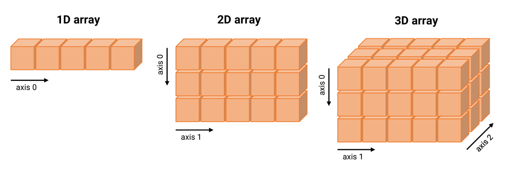
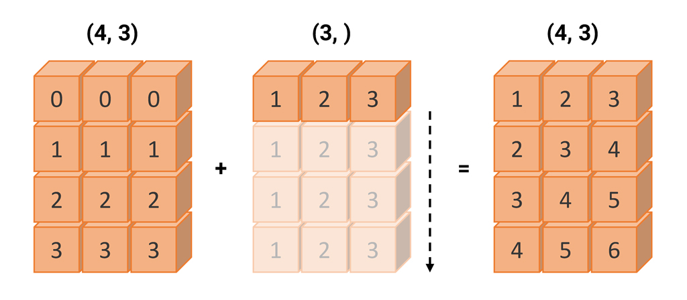
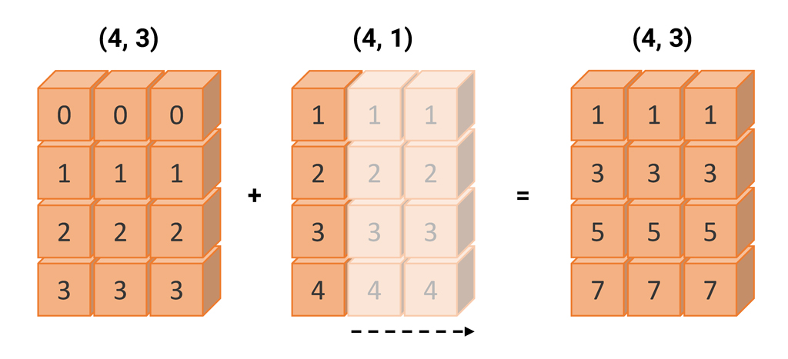
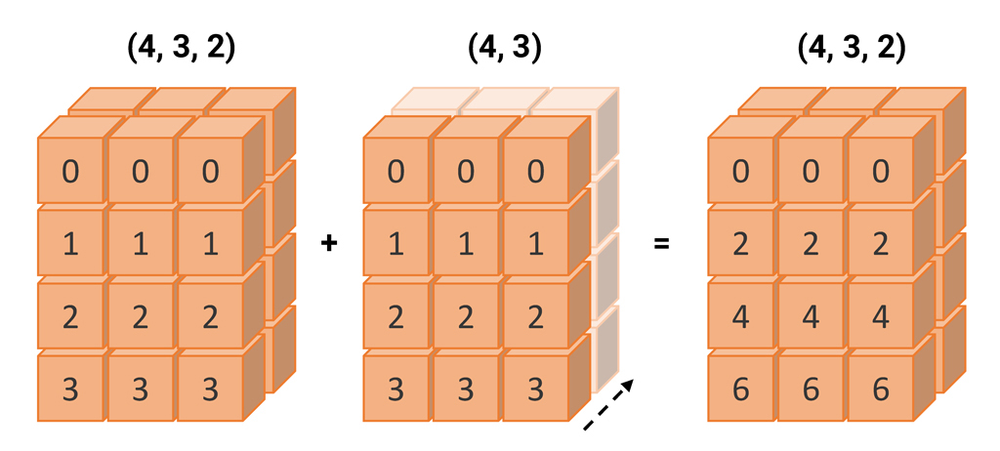
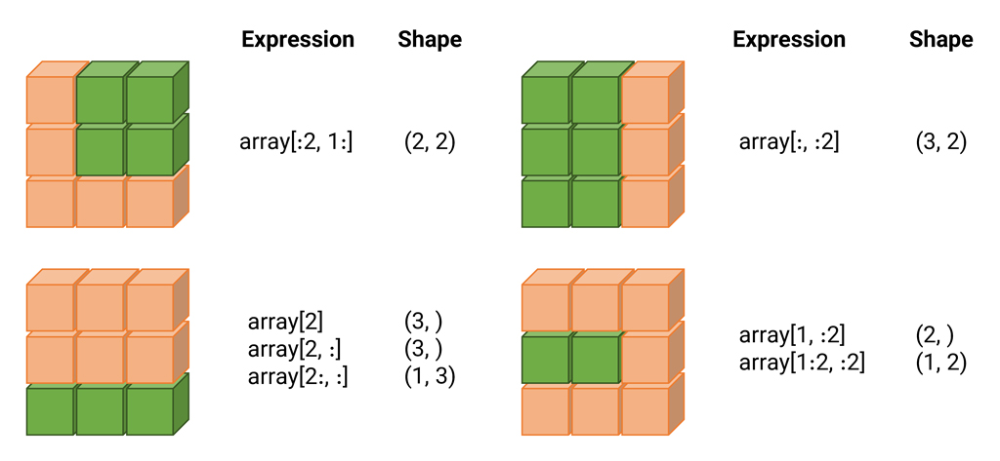

## Introduction to NumPy
[Installation](https://numpy.org/install/) | [Documentation](https://numpy.org/doc/stable/)

<div style="font-size:18px; margin-top:80px">
Last updated: March 28, 2023
</div>

---

### Introduction
NumPy, short for Numerical Python, is a fundamental library for data analysis and scientific computing in the `Python` programming language. 

---

### Advantages (1)

- **Multidimensional Arrays:** NumPy arrays can have any number of dimensions, which makes it possible to store and manipulate complex data sets.

- **High Performance:** NumPy core is based on a highly optimized `C` implementation, which means that it can perform mathematical and numerical operations much faster than pure Python.

---

### Advantages (2)

- **Mathematical Functions:** NumPy provides a wide variety of mathematical functions for operations, including statistics, linear algebra, and Fourier Transforms.

- **Efficient and Fast Computation:** NumPy allows for fast and accurate computation through powerful vectorized operations and optimized mathematical functions. 

---

### N-dimensional array

One of the key features of NumPy is its N-dimensional array object, or `ndarray`, which is a fast, flexible container for large datasets in Python.

**Note:** An 'ndarray' is a multidimensional, <u>homogeneous</u> array which means that all the elements in the array are of the same type.

---

### Creating a NumPy array (1)
The easiest way to create an `ndarray` is to use the `array()` function and pass any sequence-like object (e.g. a list, tuple, or another array) to it.

```python
import numpy as np
data = [1, 2.5, 3.1, 4, 5.6]
arr = np.array(data)
```

```output
array([1. , 2.5, 3.1, 4. , 5.6])
```

---

### Creating a NumPy array (2)

```python
import numpy as np
data = [[1, 2, 3, 4], [5, 6, 7, 8]]
arr = np.array(data)
```

```output
array([[1, 2, 3, 4],
       [5, 6, 7, 8]])
```

---

### Number of dimensions
We can check the number of dimensions of an array using the `ndim` attribute.

```output
array([[1, 2, 3, 4],
       [5, 6, 7, 8]])
```

```python
arr.ndim
```

```output
2
```

---

### Shape of an array
The `shape` attribute returns a tuple of integers indicating the size of the array in each dimension.

```output
array([[1, 2, 3, 4],
       [5, 6, 7, 8]])
```

```python
arr.shape
```

```output
(2, 4)
```

---

### Size of an array
The `size` attribute returns the total number of elements of the array.

```output
array([[1, 2, 3, 4],
       [5, 6, 7, 8]])
```

```python
arr.size
```

```output
8
```

---

### Visualization


---

### Reshaping an array
We can change the shape of an array by using:

```python
arr.reshape(new_shape)
```

where `new_shape` is a tuple of integers indicating the new shape of the array.

```output
array([[1, 2, 3, 4],
       [5, 6, 7, 8]])
```

```python
arr.reshape((4, 2))
```

```output
array([[1, 2],
       [3, 4],
       [5, 6],
       [7, 8]])
```

---

### Flattening an array
We can flatten an array by using the `flatten` method.

```output
array([[1, 2, 3, 4],
       [5, 6, 7, 8]])
```

```python
arr.flatten()
```

```output
array([1, 2, 3, 4, 5, 6, 7, 8])
```

We can also use the `ravel` or `reshape(-1)` methods to flatten an array.

---

### Data type (1)

The `dtype` attribute is an object describing the type of the elements in the array. Unless specified, NumPy tries to infer a good data type for the array that it creates.

```output
array([[1, 2, 3, 4],
       [5, 6, 7, 8]])
```

```python
arr.dtype
```

```output
dtype('int64')
```

---

### Data type (2)
A full list of NumPy data types can be found [here](https://numpy.org/devdocs/user/basics.types.html).
<div style="font-size:20px">
<table>
  <thead>
    <tr>
      <th>Type</th>
      <th>Type code</th>
      <th>Description</th>
    </tr>
  </thead>
  <tbody>
    <tr>
      <td><code>bool</code></td>
      <td><code>?</code></td>
      <td>Boolean (True or False) stored as a byte</td>
    </tr>
    <tr>
      <td><code>int8</code></td>
      <td><code>i1</code></td>
      <td>Byte (-128 to 127)</td>
    </tr>
    <tr>
      <td><code>int16</code></td>
      <td><code>i2</code></td>
      <td>Integer (-32768 to 32767)</td>
    </tr>
    <tr>
      <td><code>int32</code></td>
      <td><code>i4</code></td>
      <td>Integer (-2147483648 to 2147483647)</td>
    </tr>
    <tr>
      <td><code>int64</code></td>
      <td><code>i8</code></td>
      <td>Integer (-9223372036854775808 to 9223372036854775807)</td>
    </tr>
    <tr>
      <td><code>uint8</code></td>
      <td><code>u1</code></td>
      <td>Unsigned integer (0 to 255)</td>
    </tr>
    <tr>
      <td><code>float16</code></td>
      <td><code>f2</code></td>
      <td>Half precision float: sign bit, 5 bits exponent, 10 bits mantissa</td>
    </tr>
    <tr>
      <td><code>float32</code></td>
      <td><code>f4</code></td>
      <td>Single precision float: sign bit, 8 bits exponent, 23 bits mantissa</td>
    </tr>
    <tr>
      <td><code>float64</code></td>
      <td><code>f8</code></td>
      <td>Double precision float: sign bit, 11 bits exponent, 52 bits mantissa</td>
    </tr>
    <tr>
      <td><code>string_</code></td>
      <td><code>S</code></td>
      <td>Fixed-length ASCII string type (1 byte per character)</td>
    </tr>
    <tr>
      <td><code>unicode_</code></td>
      <td><code>U</code></td>
      <td>Fixed-length Unicode type (number of bytes platform specific)</td>
    </tr>
    <tr>
      <td><code>object</code></td>
      <td><code>O</code></td>
      <td>Python object type</td>
    </tr>
  </tbody>
</table>

</div>

---

### Data type examples (1)

Boolean

```python
array = np.array([True, False, True], dtype=bool)
```

```output
array([ True, False,  True])
```

String

```python
array = np.array(['hello', 'world', 'numpy'], dtype=np.string_)
```

```output
array([b'hello', b'world', b'numpy'], dtype='|S5')
```

---
### Data type examples (2)

Unicode

```python
array = np.array([u'سلام',u'بله',u'خیر'], dtype=np.unicode_)
```

```output
array(['سلام', 'بله', 'خیر'], dtype='<U4')
```

Object

```python
array = np.array([{"name": "John", "age": 25}, [1, 2, 3], "hello"], dtype=object)
```

```output
array([{'name': 'John', 'age': 25}, list([1, 2, 3]), 'hello'],
      dtype=object)
```

---
### Casting data type
You can explicitly cast an array from one dtype to another using ndarray's `astype` method.

```python
array = np.array([1, 2, 3, 4, 5])
```

```output
array([1, 2, 3, 4, 5])
```

```python
array.astype(np.float64)
```

```output
array([1., 2., 3., 4., 5.])
```
<div style="font-size:20px">
<b style="color:orange">Note:</b> Calling <code>astype</code> always creates a <u>copy</u> of the data, even if the new dtype is the same as the old dtype.
</div>

---

### Array creation functions (1)
`zeros` and `ones` create arrays of `0`'s or `1`'s, respectively, with a given length or shape. `empty` creates an array without initializing its values to any particular value.

```python
np.zeros(10)
```

```output
array([0., 0., 0., 0., 0., 0., 0., 0., 0., 0.])
```

```python
np.ones((2, 6))
```

```output
array([[1., 1., 1., 1., 1., 1.],
       [1., 1., 1., 1., 1., 1.]])
```

```python
np.empty((1, 2))
```

```output
array([[1., 1.]])
```

---

### Array creation functions (2)
zeros_like and ones_like create arrays of 0's or 1's with the same shape and dtype as a given array.

```python
array = np.array([[1, 2, 3], [4, 5, 6]])
```

```output
array([[1, 2, 3],
       [4, 5, 6]])
```

```python
np.zeros_like(array)
```

```output
array([[0, 0, 0],
       [0, 0, 0]])
```

```python
np.ones_like(array)
```

```output
array([[1, 1, 1],
       [1, 1, 1]])
```

---

### Array creation functions (3)
`full` creates an array of a given length or shape and fills it with a given value.

```python
np.full((2, 2), 5)
```

```output
array([[5, 5],
       [5, 5]])
```

```python
np.full((2, 2), np.pi)
```

```output
array([[3.14159265, 3.14159265],
       [3.14159265, 3.14159265]])
```

---

### Array creation functions (4)
`arange` is an array-valued version of the built-in Python `range` function. It returns an array instead of a list.

```python
np.arange(10)
```

```output
array([0, 1, 2, 3, 4, 5, 6, 7, 8, 9])
```

```python
np.arange(1, 10, 2)
```

```output
array([1, 3, 5, 7, 9])
```

---

### Array creation functions (5)
`linspace` creates an array of evenly spaced values within a given interval.

```python
np.linspace(0, 10, 5)
```

```output
array([ 0.,  2.5,  5.,  7.5, 10.])
```

```python
np.linspace(0, 10, 5, endpoint=False)
```

```output
array([0., 2., 4., 6., 8.])
```

---

### Array creation functions (6)
`eye` and `identity` create square `N x N` identity matrices. `1`'s on the diagonal and `0`'s elsewhere.

```python
np.eye(2)
```

```output
array([[1., 0.],
       [0., 1.]])
```

```python
np.identity(3)
```

```output
array([[1., 0., 0.],
       [0., 1., 0.],
       [0., 0., 1.]])
```

<div style="font-size:20px">
<b style="color:orange">Note:</b> <code>eye</code> is more flexible in creating identity matrices with diagonal shifted by any position (using <code>k</code> parameter), while <code>identity</code> is simpler and faster for creating square identity matrices with diagonal in center.
</div>

---

### Array creation functions (7)
`random` functions create arrays of random values. `rand` creates an array of the given shape and populates it with random samples from a uniform distribution over `[0, 1)`.

```python
np.random.rand(2, 3)
```

```output
array([[0.96446011, 0.79026817, 0.76676859],
       [0.21940235, 0.00295188, 0.88539941]])
```

---

### NaN and infinity
NumPy provides special floating-point values: `NaN` (not a number) and `inf` (infinity). `NaN` is a special value that represents an undefined or unrepresentable value.

```python
array = np.array([1, 2, np.nan, 3, 4, np.inf])
```

```output
array([ 1.,  2., nan,  3.,  4., inf])
```

```python
np.isnan(array)
```

```output
array([False, False,  True, False, False, False])
```

```python
np.isinf(array)
```

```output
array([False, False, False, False, False,  True])
```


---

### Arithmetic operations (1)
Vectorization is the ability of NumPy to perform mathematical computations and array operations on entire arrays without the need to write explicit loops.

Any arithmetic operations between equal-size arrays applies the operation <u>element-wise</u>.

```python
array1 = np.array([1, 2, 3, 4, 5])
array2 = np.array([5, 4, 3, 2, 1])
```

```python
array1 - array2
```

```output
array([-4, -2,  0,  2,  4])
```

```python
array1 * array2
```

```output
array([5, 8, 9, 8, 5])
```

---

### Arithmetic operations (2)
Arithmetic operations with scalars propagate the scalar argument to each element in the array.

```python
array1 = np.array([1, 2, 3, 4, 5])
```

```python
1 / array1
```

```output
array([1.        , 0.5       , 0.33333333, 0.25      , 0.2       ])
```

```python
array1 ** 2
```

```output
array([ 1,  4,  9, 16, 25])
```

---

### Arithmetic operations (3)
Comparison operators between arrays are also vectorized.

```python
array1 = np.array([1, 2, 3, 4, 5])
array2 = np.array([5, 4, 3, 2, 1])
```

```python
array1 > array2
```

```output
array([False, False, False,  True,  True])
```

```python
array1 == array2
```

```output
array([False, False,  True, False, False])
```

---

### Broadcasting
Broadcasting is a powerful technique in NumPy that allows you to perform arithmetic operations between ndarrays of different shapes and sizes.

The basic idea behind broadcasting is to extend smaller arrays to match the shape of larger arrays so that arithmetic operations can be carried out element-wise.

---

### Broadcasting Rule
Two arrays are compatible for broadcasting if for each trailing dimension (i.e. starting from the end), the dimension sizes match or one of them is 1. Broadcasting is then performed over the missing or size 1 dimensions.

```python
array1 = np.array([[0, 0, 0], [1, 1, 1], [2, 2, 2], [3, 3, 3]])
array2 = np.array([1, 2, 3])
```

```python
array1 + array2
```

```output
array([[1, 2, 3],
       [2, 3, 4],
       [3, 4, 5],
       [4, 5, 6]])
```

---

### Broadcasting Example (1)



---

### Broadcasting Example (2)



---

### Broadcasting Example (3)



---

### Broadcasting Value Error
If the arrays have different shapes and the dimension sizes cannot be matched, then a `ValueError` is raised.

```python
array1 = np.array([[0, 0, 0], [1, 1, 1], [2, 2, 2], [3, 3, 3]])
array2 = np.array([1, 2])
```

```python
array1 + array2
```

```output
ValueError: operands could not be broadcast together with shapes (4,3) (2,) 
```

---

### Integer Indexing (1)
Integer indexing allows you to select or change individual elements in an array.

```python
array = np.array([1, 2, 3, 4])
```

```python
print(array[0])
```

```output
1
```

```python
print(array[[0, 2]])
```

```output
[1 3]
```

---

### Integer Indexing (2)
Integer indexing is also used to access elements of a multidimensional array.

```python
array = np.array([[1, 2], [3, 4], [5, 6]])
```

```python
print(array[0, 0])
```

```output
1
```

```python
print(array[[0, 1], [0, 1]])
```

```output
[1 4]
```

---

### Integer Indexing (3)
Integer indexing can also be used to modify elements of an array.

```python
array = np.array([[1, 2], [3, 4], [5, 6]])
```

```python
array[0, 0] = 10
print(array)
```

```output
[[10  2]
 [ 3  4]
 [ 5  6]]
```

<div style="font-size:20px">
<b style="color:orange">Note:</b>
       <code>array[0, 0] = 10</code> is equivalent to <code>array[0][0] = 10</code>.
</div>

---

### Slicing
Slicing is the process of accessing a specific section of an ndarray object.
The pattern for slicing is:

```python
array[start:stop:step]
```

* `start` is the index of the first element to be included in the slice. Default is `0`.
* `stop` is the index of the first element to be excluded from the slice. Default is the last element.
* `step` is the number of elements to skip between elements in the slice. Default is `1`.

---

### Slicing Example (1)
```python
array = np.array([1, 2, 3, 4, 5, 6, 7, 8, 9])
```

```python
print(array[:5])
```

```output
[1 2 3 4 5]
```

```python
print(array[2:5])
```

```output
[3 4 5]
```

```python
print(array[2:])
```

```output
[3 4 5 6 7 8 9]
```

```python
print(array[1:5:2])
```

```output
[2 4]
```

---

### Slicing Example (2)
We can also use negative indices to slice an array.

```python
array = np.array([1, 2, 3, 4, 5, 6, 7, 8, 9])
```

```python
print(array[-5:-1])
```

```output
[5 6 7 8]
```

```python
print(array[-5:])
```

```output
[5 6 7 8 9]
```

```python
print(array[:-5])
```

```output
[1 2 3 4]
```

```python
print(array[-5:-1 :2])
```

```output
[5 7]
```


---

### Slicing Example (3)
```python
array = np.arange(10)
arr_slice = array[5:8]
print(arr_slice)
```

```output
[5 6 7]
```

```python
arr_slice[:] = 752
print(arr_slice)
```

```output
[752 752 752]
```

```python
print(array)
```

```output
[  0   1   2   3   4 752 752 752   8   9]
```

<div style="font-size:20px">
<b style="color:orange">Note:</b>
       <code>arr_slice</code> is a view of <code>array</code>. Any changes made to <code>arr_slice</code> will be reflected in <code>array</code>. If you want a copy of <code>array</code> instead, use <code>array.copy()</code>.
</div>

---

### Slicing Example (4)



---

### Boolean Indexing (1)
Boolean indexing is used to select elements of an ndarray based on a boolean mask that has the same shape as the ndarray. The boolean mask is usually the result of a comparison operation.

```python
names = np.array(['Bob', 'Joe', 'Will', 'Bob', 'Will', 'Joe', 'Joe'])
data = np.random.randn(7, 4)
```

```python
print(names == 'Bob')
```

```output
[ True False False  True False False False]
```

```python
print(data[names == 'Bob'])
```

```output
[[-0.85164614 -0.62923217 -1.00937517 -1.28966066]
 [ 0.38158308 -0.06660506 -0.40679032 -2.21044626]]
```

---

### Boolean Indexing (2)
We can use negation to select elements that do not satisfy a condition.

```python
print(names != 'Bob')
```

```output
[False  True  True False  True  True  True]
```

```python
print(data[names != 'Bob'])
```

```output
[[ 0.39566302 -0.05056332  0.66541337 -0.64857944]
 [-0.56789928 -3.17910369 -0.62682876  1.37407177]
 [-0.52188158  0.81734887 -0.42735326 -0.32799522]
 [ 0.05523974  0.34693793 -0.73075408 -0.61303047]
 [ 0.5012829  -0.42256724  0.47958592  0.24233269]]
```

---

### Boolean Indexing (3)
We can also combine boolean masks using the `&` (and) and `|` (or) operators.

```python
mask = (names == 'Bob') | (names == 'Will')
print(mask)
```

```output
[ True False  True  True  True False False]
```

```python
data[mask] 
```

```output
array([[-0.85164614, -0.62923217, -1.00937517, -1.28966066],
       [-0.56789928, -3.17910369, -0.62682876,  1.37407177],
       [ 0.38158308, -0.06660506, -0.40679032, -2.21044626],
       [-0.52188158,  0.81734887, -0.42735326, -0.32799522]])
```

---

### Boolean Indexing (4)
We can also use boolean indexing to modify elements of an array.

```output
[[-0.85164614 -0.62923217 -1.00937517 -1.28966066]
 [ 0.39566302 -0.05056332  0.66541337 -0.64857944]
 [-0.56789928 -3.17910369 -0.62682876  1.37407177]
 [ 0.38158308 -0.06660506 -0.40679032 -2.21044626]
 [-0.52188158  0.81734887 -0.42735326 -0.32799522]
 [ 0.05523974  0.34693793 -0.73075408 -0.61303047]
 [ 0.5012829  -0.42256724  0.47958592  0.24233269]]
```

```python
data[data < 0] = 0
```

```output
array([[0.        , 0.        , 0.        , 0.        ],
       [0.39566302, 0.        , 0.66541337, 0.        ],
       [0.        , 0.        , 0.        , 1.37407177],
       [0.38158308, 0.        , 0.        , 0.        ],
       [0.        , 0.81734887, 0.        , 0.        ],
       [0.05523974, 0.34693793, 0.        , 0.        ],
       [0.5012829 , 0.        , 0.47958592, 0.24233269]])
```

---

### Universal Functions
A universal function (or ufunc for short) is a function that performs element-wise operations on data in ndarrays. They are fast vectorized wrappers for simple functions that take one or more scalar values and produce one or more scalar results.

---

### Ufunc Example (1)

```python
array = np.arange(5)
```

```python
np.sqrt(array)
```

```output
array([0.        , 1.        , 1.41421356, 1.73205081, 2.        ])
```

```python
np.exp(array)
```

```output
array([ 1.        ,  2.71828183,  7.3890561 , 20.08553692, 54.59815003])
```

```python
np.square(array)
```

```output
array([ 0,  1,  4,  9, 16])
```

---

### Ufunc Example (2)

```python
array1 = np.random.randn(4)
array2 = np.random.randn(4)
```

```python
print(array1)
```

```output
[-0.87035484 -0.62430881  0.24429588 -1.56903064]
```

```python
print(array2)
```

```output
[-1.22755972 -0.07799901  1.53771294 -0.69276198]
```

```python
np.maximum(array1, array2)
```

```output
array([-0.87035484, -0.07799901,  1.53771294, -0.69276198])
```

```python
np.minimum(array1, array2)
```

```output
array([-1.22755972, -0.62430881,  0.24429588, -1.56903064])
```

---

### Other Ufuncs
There are many other ufuncs available in NumPy. You can find a list of them [here](https://docs.scipy.org/doc/numpy/reference/ufuncs.html#available-ufuncs). Some of the more common ones are:

<div style="font-size:20px !important">
<table>
  <thead>
    <tr>
      <th>Function</th>
      <th>Description</th>
    </tr>
  </thead>
  <tbody>
    <tr>
      <td><code>np.power</code></td>
      <td>Raise corresponding elements in arrays to specified power</td>
    </tr>
    <tr>
      <td><code>np.mod</code></td>
      <td>Return remainder of division of corresponding elements in arrays</td>
    </tr>
    <tr>
      <td><code>np.abs</code></td>
      <td>Return absolute value of corresponding elements in arrays</td>
    </tr>
    <tr>
      <td><code>np.sign</code></td>
      <td>Return sign of corresponding elements in arrays</td>
    </tr>
    <tr>
      <td><code>np.cos</code>, <code>np.sin</code>, <code>np.tan</code></td>
      <td>Trigonometric functions</td>
    </tr>
    <tr>
      <td><code>np.arccos</code>, <code>np.arcsin</code>, <code>np.arctan</code></td>
      <td>Inverse trigonometric functions</td>
    </tr>
    <tr>
      <td><code>np.log</code>, <code>np.log10</code>, <code>np.log2</code></td>
      <td>Logarithmic functions</td>
    </tr>
    <tr>
      <td><code>np.ceil</code>, <code>np.floor</code></td>
      <td>Round up and down to nearest integer</td>
    </tr>
  </tbody>
</table>
</div>

---

### Aggregate Functions
Aggregate functions are functions that operate on an entire array and return a single value. Some of the more common aggregate functions are:

<div style="font-size:20px !important">
<table>
  <thead>
    <tr>
      <th>Function</th>
      <th>Description</th>
    </tr>
  </thead>
  <tbody>
    <tr>
      <td><code>np.sum</code></td>
      <td>Sum of all elements in array</td>
    </tr>
    <tr>
      <td><code>np.mean</code></td>
      <td>Mean of all elements in array</td>
    </tr>
    <tr>
      <td><code>np.std</code></td>
      <td>Standard deviation of all elements in array</td>
    </tr>
    <tr>
      <td><code>np.var</code></td>
      <td>Variance of all elements in array</td>
    </tr>
    <tr>
      <td><code>np.min</code>, <code>np.max</code></td>
      <td>Minimum and maximum of all elements in array</td>
    </tr>
    <tr>
      <td><code>np.argmin</code>, <code>np.argmax</code></td>
      <td>Indices of minimum and maximum of all elements in array</td>
    </tr>
    <tr>
      <td><code>np.median</code></td>
      <td>Median of all elements in array</td>
    </tr>
    <tr>
      <td><code>np.percentile</code></td>
      <td>Percentile of all elements in array</td>
    </tr>
  </tbody>
</table>
</div>

You can find a full list [here](https://docs.scipy.org/doc/numpy/reference/routines.math.html) and [here](https://docs.scipy.org/doc/numpy/reference/routines.statistics.html).

---

### Aggregation Example (1)

```python
array = np.array([[1, 2, 3], [4, 5, 6]])
array
```

```output
array([[1, 2, 3],
       [4, 5, 6]])
```

```python
array.sum()
```

```output
21
```

```python
array.sum(axis=0)
```

```output
array([5, 7, 9])
```

```python
array.sum(axis=1)
```

```output
array([ 6, 15])
```

---

### Aggregation Example (2)

```output
array([[1, 2, 3],
       [4, 5, 6]])
```

```python
array.mean()
```

```output
3.5
```

```output
array([2.5, 3.5, 4.5])
```

```python
array.std()
```

```output
1.707825127659933
```

```python
array.var()
```

```output
2.9166666666666665
```

```python
array.median(axis=1)
```

```output
array([2., 5.])
```

---

### Aggregation Example (3)

```output
array([[1, 2, 3],
       [4, 5, 6]])
```

```python
array.min()
```

```output
1
```

```python
array.max()
```

```output
6
```

```python
array.argmin()
```

```output
0
```

```python
array.argmax()
```

```output
5
```

---

### Concatenation
NumPy arrays can be concatenated using the `concatenate` function. We can concatenate arrays along the rows or the columns.

```python
array1 = np.array([[1, 2, 3], [4, 5, 6]])
array2 = np.array([[7, 8, 9], [10, 11, 12]])
```

```python
np.concatenate([array1, array2])
```

```output
array([[ 1,  2,  3],
       [ 4,  5,  6],
       [ 7,  8,  9],
       [10, 11, 12]])
```

```python
np.concatenate([array1, array2], axis=1)
```

```output
array([[ 1,  2,  3,  7,  8,  9],
       [ 4,  5,  6, 10, 11, 12]])
```

---

### hstack and vstack
NumPy also provides the `hstack` and `vstack` functions for concatenating arrays along the rows and columns respectively.

```python
array1 = np.array([[1, 2, 3], [4, 5, 6]])
array2 = np.array([[7, 8, 9], [10, 11, 12]])
```

```python
np.vstack([array1, array2])
```

```output
array([[ 1,  2,  3],
       [ 4,  5,  6],
       [ 7,  8,  9],
       [10, 11, 12]])
```

```python
np.hstack([array1, array2])
```

```output
array([[ 1,  2,  3,  7,  8,  9],
       [ 4,  5,  6, 10, 11, 12]])
```

---

### Column Stacking
We can also stack arrays along the columns using the `column_stack` function.

```python
array1 = np.array([1, 2, 3])
array2 = np.array([4, 5, 6])
```

```python
np.column_stack([array1, array2])
```

```output
array([[1, 4],
       [2, 5],
       [3, 6]])
```

```python
np.vstack([array1, array2])
```

```output
array([[1, 2, 3],
       [4, 5, 6]])
```

```python
np.hstack([array1, array2])
```

```output
array([1, 2, 3, 4, 5, 6])
```


---

### Splitting
NumPy arrays can be split using the `split` function. We can split arrays along the rows or the columns.

```python
array = np.array([[1, 2, 3, 4], [5, 6, 7, 8], [9, 10, 11, 12]])
```

```python
np.split(array, 3)
```

```output
[array([[1, 2, 3, 4]]),
 array([[5, 6, 7, 8]]),
 array([[ 9, 10, 11, 12]])]
```

```python
np.split(array, 3, axis=1)
```

```output
[array([[ 1,  2],
        [ 5,  6],
        [ 9, 10]]),
 array([[ 3,  4],
        [ 7,  8],
        [11, 12]]),
 array([], shape=(3, 0), dtype=int64)]
```

---

### Methods for Boolean Arrays
NumPy has a number of methods for boolean arrays.

```python
array = np.array([1, 2, 3, 4, 5])
```

```python
array > 3
```

```output
array([False, False, False,  True,  True])
```

```python
(array > 3).sum()
```

```output
2
```

```python
(array > 3).any()
```

```output
True
```

```python
(array > 3).all()
```

```output
False
```

---

### Sort
NumPy arrays can be sorted inplace using the `sort` method.

```python
array = np.array([5, 2, 3, 1, 4])
array.sort()
```

```output
array([1, 2, 3, 4, 5])
```

```python
array = np.array([[5, 2, 3],
                  [1, 4, 6]])
array.sort(axis=0)
```

```output
array([[1, 2, 3],
       [5, 4, 6]])
```

```python
array.sort(axis=1)
```

```output
array([[1, 2, 3],
       [4, 5, 6]])
```

---

### Arg Sort
The `argsort` method returns the indices of the sorted array.

```python
array = np.array([5, 2, 3, 1, 4])
array.argsort()
```

```output
array([3, 1, 2, 4, 0])
```

---

### Unique Elements
NumPy has a `unique` function that returns the unique elements in an array.

```python
array = np.array([1, 1, 2, 2, 3, 3, 4, 4])
np.unique(array)
```

```output
array([1, 2, 3, 4])
```

```python
array = np.array([[1, 1], [2, 3]])
np.unique(array)
```

```output
array([1, 2, 3])
```

---

### Vectorize method
The `vectorize` method allows us to apply a function to every element in an array. 

```python
array = np.array(['1,000', '2,000', '3,000'])
```

```python
def my_func(x):
    return int(x.replace(',', ''))
remove_commas = np.vectorize(my_func)
remove_commas(array)
```

```output
array([1000, 2000, 3000])
```

```python
remove_commas = np.vectorize(lambda x: int(x.replace(',', '')))
remove_commas(array)
```

<div style="font-size:20px">
<b style="color:orange">Note:</b> 
The primary advantage of using <code>vectorize</code> over using a loop (for or while) is that the function's performance is optimized, which makes the operation <u>faster</u> and <u>more efficient</u>.
</div>


---

### File Input and Output
We can save and load NumPy arrays to and from disk using the `save` and `load` functions.

```python
array = np.array([1, 2, 3, 4, 5])
np.save('my_array', array)
```

```python
np.load('my_array.npy')
```

```output
array([1, 2, 3, 4, 5])
```

```python
array1 = np.array([1, 2, 3, 4, 5])
array2 = np.array([6, 7, 8, 9, 10])
np.savez('my_arrays.npz', a=array1, b=array2)
```

```python
archive_array = np.load('my_arrays.npz')
archive_array['a']
```

```output
array([1, 2, 3, 4, 5])
```

---

### Linear Algebra
NumPy also has a number of functions for linear algebra. These are available in the `np.linalg` module. Some of the more common ones are:

<div style="font-size:20px !important">
<table>
  <thead>
    <tr>
      <th>Function</th>
      <th>Description</th>
    </tr>
  </thead>
  <tbody>
      <tr>
       <td><code>np.transpose</code></td>
       <td>Transpose of matrix (similar to <code>array.T</code>)</td>
       </tr>
    <tr>
       <td><code>np.dot</code></td>
       <td>Dot product of two arrays</td>
    </tr>
    <tr>
       <td><code>np.inner</code></td>
       <td>Inner product of two arrays</td>
    </tr>
       <tr>
          <td><code>np.matmul</code></td>
          <td>Matrix multiplication (similar to @ operator)</td>
       </tr>
           <tr>
      <td><code>np.linalg.inv</code></td>
      <td>Invert matrix</td>
    </tr>
    <tr>
      <td><code>np.linalg.det</code></td>
      <td>Determinant of matrix</td>
    </tr>
    <tr>
      <td><code>np.linalg.eig</code></td>
      <td>Eigenvalues and eigenvectors of matrix</td>
    </tr>
    <tr>
      <td><code>np.linalg.solve</code></td>
      <td>Solve linear system of equations</td>
    </tr>
    <tr>
      <td><code>np.linalg.norm</code></td>
      <td>Norm of vector</td>
    </tr>
  </tbody>
</table>
</div>

You can find a full list of linear algebra functions [here](https://docs.scipy.org/doc/numpy/reference/routines.linalg.html).

---

### Linear Algebra Example

```python
array1 = np.array([[1, 2],
                   [3, 4]])
array2 = np.array([[5, 6],
                   [7, 8]])
```

```python
np.matmul(array1, array2) # or array1 @ array2
```

```output
array([[19, 22],
       [43, 50]])
```

```python
np.inner(array1, array2)
```

```output
array([[17, 23],
       [39, 53]])
```

```python
np.dot(array1, array2) # or array1.dot(array2)
```

```output
array([[19, 22],
       [43, 50]])
```

<div style="font-size:20px">
<b style="color:orange">Note:</b> 
Check <a href="https://mkang32.github.io/python/2020/08/30/numpy-matmul.html">this</a> out if you want to know more about the difference between <code>np.dot</code> and <code>np.matmul</code>.
</div>

---

### Pseudorandom Numbers
We saw earlier that we can use the `rand` function to generate random numbers from a uniform distribution. We can also generate random numbers from other distributions using the `random` module.

<div style="font-size:20px !important">
<table>
  <thead>
    <tr>
      <th>Function</th>
      <th>Description</th>
    </tr>
  </thead>
  <tbody>
    <tr>
      <td><code>np.random.rand</code></td>
      <td>Uniform distribution over [0, 1)</td>
    </tr>
    <tr>
      <td><code>np.random.randn</code></td>
      <td>Standard normal distribution</td>
    </tr>
    <tr>
      <td><code>np.random.randint</code></td>
      <td>Uniform distribution of integers</td>
    </tr>
    <tr>
      <td><code>np.random.random</code></td>
      <td>Uniform distribution over [0, 1)</td>
    </tr>
    <tr>
      <td><code>np.random.normal</code></td>
      <td>Normal distribution</td>
    </tr>
    <tr>
      <td><code>np.random.binomial</code></td>
      <td>Binomial distribution</td>
    </tr>
    <tr>
      <td><code>np.random.poisson</code></td>
      <td>Poisson distribution</td>
    </tr>
  </tbody>
</table>
</div>

Check out the [documentation](https://docs.scipy.org/doc/numpy/reference/random/index.html) for a full list of functions.

---

### Shuffle
We can use the `shuffle` function to shuffle the elements of an array.

```python
array = np.arange(10)
np.random.shuffle(array)
array
```

```output
array([3, 5, 2, 1, 9, 4, 0, 8, 7, 6])
```

---

### Seed (1)
We can use the `seed` function to set the seed for the pseudorandom number generator. This is useful for reproducibility. If we set the seed to the same value, we will get the same sequence of random numbers.

```python
np.random.seed(0)
```

```python
np.random.rand(5)
```

```output
array([0.5488135 , 0.71518937, 0.60276338, 0.54488318, 0.4236548 ])
```

```python
np.random.rand(5)
```

```output
array([0.64589411, 0.43758721, 0.891773  , 0.96366276, 0.38344152])
```
<div style="font-size:20px">
<b style="color:orange">Note:</b> 
If you run the above code again, you will get the same sequence of random numbers.
</div>

---

### Seed (2)
The  `np.random` use a global random seed. To avoid this, we can use the `RandomState` class. To avoid global state, you can use `RandomState` to create a random number generator isolated from others.

```python
rng = np.random.RandomState(1234)
```

```python
rng.rand(5)
```

```output
array([0.19151945, 0.62210877, 0.43772774, 0.78535858, 0.77997581])
```

---

## Finishing Up
Thank you for keeping up with me until the end!

If you have any questions or suggestions, please send me an email at [parsa.abbasi1996@gmail.com](mailto:parsa.abbasi1996@gmail.com?subject=Mail%20about%20numpy).
