## Introduction to Pandas
[Installation](https://pandas.pydata.org/docs/getting_started/install.html) | [Documentation](https://pandas.pydata.org/docs/)

<div style="font-size:18px; margin-top:80px">
Last updated: March 28, 2023
</div>

---

### What is Pandas?
Pandas is a popular Python library that offers high-performance and easy-to-use data manipulation and analysis tools. It is a go-to library for working with structured and semi-structured data such as tables and time-series data. Pandas provides a wide range of functions and data structures that allow data scientists, analysts, and researchers to quickly clean, transform, and manipulate data to extract meaningful insights.

---

### Why Pandas? (1)

* **Efficient Handling of Tabular Data:** Pandas can efficiently handle tabular data, enabling users to work with data from various file formats like CSV, Excel, SQL databases, and more.

* **Support for Huge Datasets:** Pandas is designed to work with large datasets, and it provides several tools to efficiently process, filter, and manipulate large datasets without running out of memory. This enables users to work with datasets that are too big to fit into memory on a single machine.

---

### Why Pandas? (2)

* **Easy Data Manipulation:** Pandas provides a wide range of functions that allow users to quickly clean, transform, and manipulate data to extract meaningful insights.

* **Time Series Analysis:** Pandas has built-in support for time series data analysis, making it easy to work with time-stamped data, such as stock prices, weather data, or social media metrics.

---

### Series
A `Series` is a one-dimensional array of labeled data that can hold any data type, such as numbers, strings, booleans, or even objects. A `Series` has two main components: 
1. The index: a sequence of labels that identify each element in the series.
2. The values: the actual data stored in the series.

---

### Creating a Series

You can create a series from various sources, such as lists, dictionaries, numpy arrays, or scalars. You just need to pass the data to the `pd.Series()` function.

```python
import pandas as pd
my_list = [10, 20, 30, 40, 50]
my_series = pd.Series(my_list)
print(my_series)
```

```python
0    10
1    20
2    30
3    40
4    50
dtype: int64
```

---

### Setting Index Labels
We can specify the index labels when creating a series.

```python
my_series = pd.Series(my_list, index=['a', 'b', 'c', 'd', 'e'])
print(my_series)
```

```python
a    10
b    20
c    30
d    40
e    50
dtype: int64
```

---

### Extracting Components
We can get the index and values of a series using the `index` and `values` attributes. The values of a series are always stored as a <u>numpy</u> array.

```python
a    10
b    20
c    30
d    40
e    50
dtype: int64
```

```python
print(my_series.index)
print(my_series.values)
```

```python
Index(['a', 'b', 'c', 'd', 'e'], dtype='object')
[10 20 30 40 50]
```

---

### Dictionary to Series
A Series can be also created from a dictionary. The keys of the dictionary will be used as the index labels.

```python
population_dict = {'Amsterdam': 821752, 'Rotterdam': 623652, 'The Hague': 514861, 'Utrecht': 345043, 'Eindhoven': 223027}
population = pd.Series(population_dict)
print(population)
```

```python
Amsterdam    821752
Rotterdam    623652
The Hague    514861
Utrecht      345043
Eindhoven    223027
dtype: int64
```

---

### Name Attribute
Both the Series object itself and its index have a `name` attribute. This can be useful when you are working with multiple series.

```python
population.name = 'Population'
population.index.name = 'City'
print(population)
```

```python
City
Amsterdam    821752
Rotterdam    623652
The Hague    514861
Utrecht      345043
Eindhoven    223027
Name: Population, dtype: int64
```

---

### Accessing Elements (1)
We can access the elements of a series using the index labels.

```python
print(population['Amsterdam'])
print(population['Rotterdam'])
```

```python
821752
623652
```

---

### Accessing Elements (2)
We can also access the elements of a series using the index positions.

```python
print(population[0])
print(population[1])
```

```python
821752
623652
```

---

### Slicing a Series (1)
We can also slice a series using the index labels.

```python
City
Amsterdam    821752
Rotterdam    623652
The Hague    514861
Utrecht      345043
Eindhoven    223027
Name: Population, dtype: int64
```

```python
print(population['Amsterdam':'Utrecht'])
```

```python
City
Amsterdam    821752
Rotterdam    623652
The Hague    514861
Utrecht      345043
Name: Population, dtype: int64
```

---

### Slicing a Series (2)
Instead of using the index labels, we can also use the index positions to slice a series.

```python
City
Amsterdam    821752
Rotterdam    623652
The Hague    514861
Utrecht      345043
Eindhoven    223027
Name: Population, dtype: int64
```

```python
print(population[:2])
```

```python
City
Amsterdam    821752
Rotterdam    623652
Name: Population, dtype: int64
```

---

### Arithmetic Operations (1)
We can perform arithmetic operations on a series. The operations will be applied to each element of the series.

```python
City
Amsterdam    821752
Rotterdam    623652
The Hague    514861
Utrecht      345043
Eindhoven    223027
Name: Population, dtype: int64
```

```python
print(population / 1000)
```

```python
City
Amsterdam    821.752
Rotterdam    623.652
The Hague    514.861
Utrecht      345.043
Eindhoven    223.027
Name: Population, dtype: float64
```

---

### Arithmetic Operations (2)
We can also perform arithmetic operations between two series. The operations will be applied to each element of the series.

```python
series1 = pd.Series([1, 2, 3, 4, 5], index=['a', 'b', 'c', 'd', 'e'])
series2 = pd.Series([6, 7, 8, 9, 10], index=['a', 'b', 'd', 'e', 'f'])
print(series1 + series2)
```

```python
a     7.0
b     9.0
c     NaN
d    12.0
e    14.0
f     NaN
dtype: float64
```

---

### Boolean Operations
We can also perform boolean operations on a series. The result will be a boolean series.

```python
City
Amsterdam    821752
Rotterdam    623652
The Hague    514861
Utrecht      345043
Eindhoven    223027
Name: Population, dtype: int64
```

```python
print(population > 500000)
```

```python
City
Amsterdam     True
Rotterdam     True
The Hague    False
Utrecht      False
Eindhoven    False
Name: Population, dtype: bool
```

---

### Filtering a Series
We can use the boolean series to filter the original series.

```python
City
Amsterdam    821752
Rotterdam    623652
The Hague    514861
Utrecht      345043
Eindhoven    223027
Name: Population, dtype: int64
```

```python
print(population[population > 500000])
```

```python
City
Amsterdam    821752
Rotterdam    623652
Name: Population, dtype: int64
```

---

### Series Methods
Series objects have many useful methods that can be used to perform calculations on the data.
For example, we can use the `describe()` method to get some basic statistics about the series.

```python
print(population.describe())
```

```python
count         5.000000
mean     505667.000000
std      234307.573534
min      223027.000000
25%      345043.000000
50%      514861.000000
75%      623652.000000
max      821752.000000
Name: Population, dtype: float64
```

You can find a list of all the methods [here](https://pandas.pydata.org/pandas-docs/stable/reference/series.html).

---

### Unique Values
We can use the `unique()` and `nunique()` methods to get the unique values and the number of unique values.

```python
0               Utrecht University
1                Leiden University
2               Utrecht University
3    Radboud University Nijmegen
4                Leiden University
5          University of Groningen
6               Tilburg University
dtype: object
```

```python
print(universities.unique())
print(universities.nunique())
```

```python
['Utrecht University' 'Leiden University' 'Radboud University Nijmegen'
 'University of Groningen' 'Tilburg University']
5
```

---

### Value Counts
We can use the `value_counts()` method to get the number of times each value appears in the series.

```python
0               Utrecht University
1                Leiden University
2               Utrecht University
3    Radboud University Nijmegen
4                Leiden University
5          University of Groningen
6               Tilburg University
dtype: object
```

```python
print(universities.value_counts())
```

```python
Utrecht University             2
Leiden University              2
Radboud University Nijmegen    1
University of Groningen        1
Tilburg University             1
dtype: int64
```

---

### Ascending Sort
We can use the `sort_values()` method to sort the series.

```python
area = pd.Series({'Rotterdam': 41.4, 'Utrecht': 30.5, 'Amsterdam': 219.3, 'Eindhoven': 30.5, 'The Hague': 31.4})
```

```python
area.sort_values()
```

```python
Utrecht       30.5
Eindhoven     30.5
The Hague     31.4
Rotterdam     41.4
Amsterdam    219.3
dtype: float64
```

---

### Descending Sort
We can also sort the series in descending order using the `ascending` parameter.

```python
area.sort_values(ascending=False)
```

```python
Amsterdam    219.3
Rotterdam     41.4
The Hague     31.4
Utrecht       30.5
Eindhoven     30.5
dtype: float64
```

---

### Inplace Argument
The result of the `sort_values()` method is a new series, so we need to assign it to a variable if we want to keep it. We can also sort the series in-place using the `inplace` parameter.

```python
area.sort_values(ascending=False, inplace=True)
```

```python
print(area)
```

```python
Amsterdam    219.3
Rotterdam     41.4
The Hague     31.4
Utrecht       30.5
Eindhoven     30.5
dtype: float64
```

---

### Sorting by Index
We can also sort the series by the index using the `sort_index()` method.

```python
Rotterdam     41.4
Utrecht       30.5
Amsterdam    219.3
Eindhoven     30.5
The Hague     31.4
dtype: float64
```

```python
area.sort_index()
```

```python
Amsterdam    219.3
Eindhoven     30.5
Rotterdam     41.4
The Hague     31.4
Utrecht       30.5
dtype: float64
```

---

### NaN Values (1)
NaN values are used to represent missing data. We can use the `isnull()` method to check for NaN values.

```python
Rotterdam     41.4
Utrecht       30.5
Amsterdam    219.3
Maastricht     NaN
Eindhoven     30.5
The Hague     31.4
dtype: float64
```

```python
print(area.isnull())
```

```python
Rotterdam     False
Utrecht       False
Amsterdam     False
Maastricht     True
Eindhoven     False
The Hague     False
dtype: bool
```

---

### NaN Values (2)
We can use the `sum()` method to count the number of NaN values.

```python
print(area.isnull().sum())
```

```python
1
```

---

### Aggregation
Similar to numpy arrays, we can use many aggregation methods on a series.

```python
print(area.sum())
```

```python
353.1
```

```python
print(area.mean())
```

```python
70.62
```

```python
print(area.std())
```

```python
83.24209872414319
```

---

### DataFrame
A DataFrame is a 2-dimensional data structure that can store data of different types in each column. It is similar to a spreadsheet or a SQL table.

<div style="font-size:20px">
<b style="color:orange">Note:</b>
While a DataFrame is physically 2-dimensional, but it can be used to represent higher dimensional data in a tabular format using <a href="https://pandas.pydata.org/pandas-docs/stable/user_guide/advanced.html#hierarchical-indexing-multiindex">hierarchical indexing</a>.
</div>

---

### DataFrame Components
A DataFrame is made up of three components:   
the index, the columns, and the data.

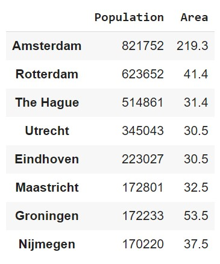

---

### DataFrame Creation (1)
The most straightforward way to create a DataFrame is to pass a dictionary to the `pd.DataFrame()` constructor.

```python
data = {'Name': ['Valheim', 'Among Us', 'Minecraft', 'Fortnite', 'Genshin Impact'],
        'Year': [2021, 2018, 2011, 2017, 2020],
        'Genre': ['Survival', 'Social Deduction', 'Sandbox', 'Battle Royale', 'Action RPG'],
        'Developer': ['Iron Gate Studio', 'InnerSloth', 'Mojang', 'Epic Games', 'miHoYo'],
        'Price': [19.99, 4.99, 26.95, 0.00, 0.00]}
```

```python
df = pd.DataFrame(data)
```

---

### DataFrame Creation (2)

```python
df
```

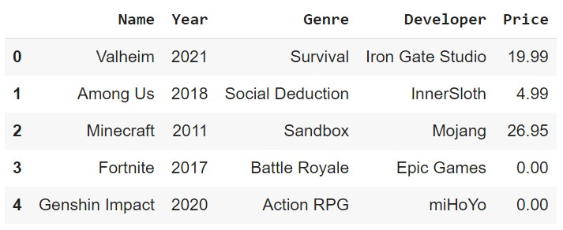

---

### DataFrame Creation (3)
We could also pass a list of dictionaries to the `pd.DataFrame()` constructor.

```python
data = [{'Name': 'Valheim', 'Year': 2021, 'Genre': 'Survival', 'Developer': 'Iron Gate Studio', 'Price': 19.99},
        {'Name': 'Among Us', 'Year': 2018, 'Genre': 'Social Deduction', 'Developer': 'InnerSloth', 'Price': 4.99},
        {'Name': 'Minecraft', 'Year': 2011, 'Genre': 'Sandbox', 'Developer': 'Mojang', 'Price': 26.95},
        {'Name': 'Fortnite', 'Year': 2017, 'Genre': 'Battle Royale', 'Developer': 'Epic Games', 'Price': 0.00},
        {'Name': 'Genshin Impact', 'Year': 2020, 'Genre': 'Action RPG', 'Developer': 'miHoYo', 'Price': 0.00}]
```

```python
df = pd.DataFrame(data)
```

---

### DataFrame Creation (4)
We could also pass a list of lists or tuples to the `pd.DataFrame()` constructor.

```python
data = [['Valheim', 2021, 'Survival', 'Iron Gate Studio', 19.99],
        ['Among Us', 2018, 'Social Deduction', 'InnerSloth', 4.99],
        ['Minecraft', 2011, 'Sandbox', 'Mojang', 26.95],
        ['Fortnite', 2017, 'Battle Royale', 'Epic Games', 0.00],
        ['Genshin Impact', 2020, 'Action RPG', 'miHoYo', 0.00]]
```

```python
df = pd.DataFrame(data, columns=['Name', 'Year', 'Genre', 'Developer', 'Price'])
```

---

### Head and Tail
We can see the first `n` rows and the last `n` rows of a DataFrame using the `head(n)` and `tail(n)` methods. The default value of `n` is 5.

```python
df.head(3)
```

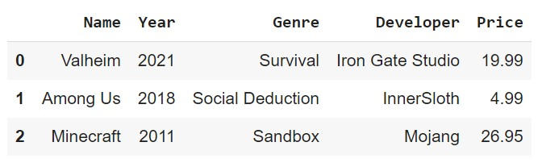

---

### Sample
We can also get a random sample of `n` rows using the `sample(n)` method.

```python
df.sample(2)
```

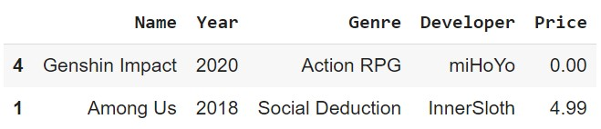

---

### Get Column Names
We can get the column names of a DataFrame using the `columns` attribute.

```python
df.columns
```

```python
Index(['Name', 'Year', 'Genre', 'Developer', 'Price'], dtype='object')
```

We can also get the column names as a list using the `tolist()` method.

```python
df.columns.tolist()
```

```python
['Name', 'Year', 'Genre', 'Developer', 'Price']
```

---

### Rename Columns
We can rename the columns of a DataFrame using the `rename()` method.

```python
df.rename(columns={'Name': 'Game', 'Year': 'Release Year', 'Genre': 'Game Genre', 'Developer': 'Game Developer', 'Price': 'Game Price'}, inplace=True)
# or df.columns = ['Game', 'Release Year', 'Game Genre', 'Game Developer', 'Game Price']
```

```python
df
```

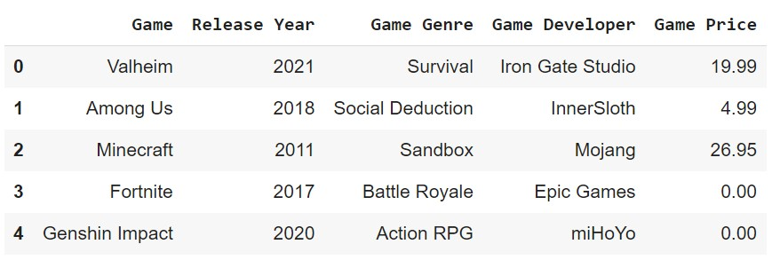

---

### Column Data Types
We can get the type of a column using the `dtypes` attribute.

```python
df.dtypes
```

```python
Game                object
Release Year         int64
Game Genre          object
Game Developer      object
Game Price         float64
dtype: object
```

```python
df['Game Genre'].dtype
```

```python
dtype('O')
```

---

### Retrieve A Column
We can retrieve the values of a column using the `[]` operator. If the column name is a string with no spaces, we can also use the `.` operator. The result is a Series.

```python
df['Game']
```

```python
df.Game
```

```python
0           Valheim
1          Among Us
2         Minecraft
3          Fortnite
4    Genshin Impact
Name: Game, dtype: object
```

---

### Retrieve Multiple Columns
We can also retrieve multiple columns. The result is a DataFrame with only the selected columns.

```python
df[['Game', 'Game Genre']]
```


---

### Get Index
We can get the index of a DataFrame using the `index` attribute.

```python
df.index
```

```python
RangeIndex(start=0, stop=5, step=1)
```

`RangeIndex` is a special type of index that is used when the index is a sequence of numbers. We can also get the index as a list using the `tolist()` method.

---

### Set Index
We can set the index of a DataFrame using the `set_index()` method.

```python
df.set_index('Game', inplace=True)
```

```python
df
```

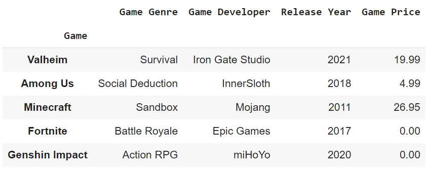

---

### Reset Index
We can reset the index of a DataFrame using the `reset_index()` method. The `drop` parameter determines whether the old index is dropped or not.

```python
df.reset_index(drop=False, inplace=True)
```

```python
df
```


---

### Retrieve A Row
We can retrieve a row using the `loc[]` or `iloc[]` operator. The difference between the two is that `loc` uses the index <u>label</u>, while `iloc` uses the index <u>position</u>.

```python
df1 = pd.DataFrame([[1, 2], [4, 5], [7, 8]], index=[1, 2, 3], columns=['col1', 'col2'])
```

```python
df1.iloc[0]
```

```python
col1    1
col2    2
Name: 1, dtype: int64
```

```python
df1.loc[0]
```

```python
KeyError: 0
```

---

### Slice Rows
We can also slice rows using the `loc[]` or `iloc[]` operator. Be aware that the `loc` operator includes the last index, while the `iloc` operator does not.

```python
   col1  col2
1     1     2
2     4     5
3     7     8
```


```python
df1.iloc[1:2]
```

```python
   col1  col2
2     4     5
```

```python
df1.loc[1:2]
```

```python
   col1  col2
1     1     2
2     4     5
```

---

### Retrieve A Cell
The `loc[]` and `iloc[]` operators can also be used to retrieve a cell.

```python
   col1  col2
1     1     2
2     4     5
3     7     8
```

```python
df1.iloc[0, 0]
```

```python
1
```

```python
df1.loc[1, 'col1']
```

```python
1
```

---

### Changing Values
We can change the values of a cell after retrieving it.

```python
df1.iloc[0, 0] = 10
```

```python
   col1  col2
1    10     2
2     4     5
3     7     8
```

```python
df1.loc[[2, 3], 'col2'] = 100
```

```python
   col1  col2
1    10     2
2     4   100
3     7   100
```

---

### Replace Values
We can replace values in a DataFrame using the `replace()` method.

```python
df1.replace(100, 200)
```

```python
   col1  col2
1    10     2
2     4   200
3     7   200
```

---

### DataFrame Info
We can get a summary of a DataFrame using the `info()` method.

```python
df.info()
```

```python
<class 'pandas.core.frame.DataFrame'>
RangeIndex: 5 entries, 0 to 4
Data columns (total 5 columns):
 #   Column          Non-Null Count  Dtype  
---  ------          --------------  -----  
 0   Game            5 non-null      object 
 1   Game Genre      5 non-null      object 
 2   Game Developer  5 non-null      object 
 3   Release Year    5 non-null      int64  
 4   Game Price      5 non-null      float64
dtypes: float64(1), int64(1), object(3)
memory usage: 328.0+ bytes
```

---

### DataFrame Description
We can also get a description of a DataFrame.

```python
df.describe()
```

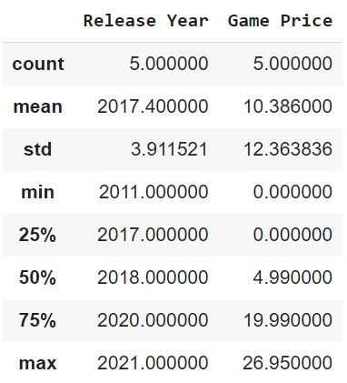

---

### Casting Data Types
Similar to NumPy, we can cast the data types of a DataFrame using the `astype()` method.

```python
df['Game Price'] = df['Game Price'].astype('int64')
```

---

### Apply Function
Using the `apply()` method, we can apply a function to a column, row, or DataFrame.

```python
def dollar_to_euro(price):
    return price * 0.92

df['Game Price'] = df['Game Price'].apply(dollar_to_euro)
# Or df['Game Price'] = df['Game Price'].apply(lambda price: price * 0.92)
```

```python
0    17.48
1     3.68
2    23.92
3     0.00
4     0.00
Name: Game Price, dtype: float64
```

---

### Map Function
The `map()` method is similar to the `apply()` method, but it is used to map values from one set to another.

```python
df['Game Genre'].map({'Action RPG': 0, 'Battle Royale': 1, 'Sandbox': 2, 'Survival': 3, 'Social Deduction': 4})
```

```python
0    3
1    4
2    2
3    1
4    0
Name: Game Genre, dtype: int64
```

---

### Sorting
We can sort a DataFrame using the `sort_values()` method. The `by` parameter determines which column to sort by. The `ascending` parameter determines whether to sort in ascending or descending order.

```python
df.sort_values(by='Game Price', ascending=False)
```

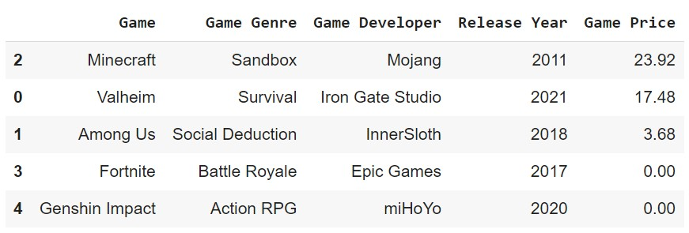

<div style="font-size:20px">
<b style="color:orange">Note:</b>
Don't forget to set <code>inplace=True</code> if you want to replace the original DataFrame.
</div>

---

### Drop Entries
We can drop entries from a DataFrame using the `drop()` method. The `axis` parameter determines whether to drop rows or columns. The `inplace` parameter determines whether to drop the entries in the original DataFrame or not.

```python
df.drop([0, 2], axis=0)
```

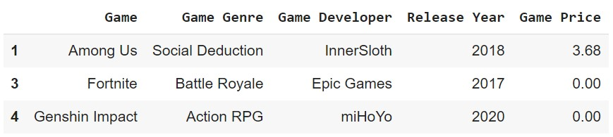

<div style="font-size:20px">
<b style="color:orange">Note:</b>
Don't forget to set <code>inplace=True</code> if you want to drop the entries in the original DataFrame.
</div>

---

### Drop Columns
The `drop()` method can also be used to drop columns.

```python
df.drop(['Game Genre', 'Game Developer'], axis=1)
# Or df.drop(columns=['Game Genre', 'Game Developer'])
```


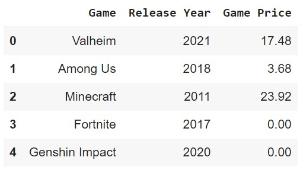

<div style="font-size:20px">
<b style="color:orange">Note:</b>
Don't forget to set <code>inplace=True</code> if you want to drop the columns in the original DataFrame.
</div>

---

### Filtering (1)
We can use boolean indexing to filter entries.

```python
df['Game Price'] > 20
```

```
0    False
1    False
2     True
3    False
4    False
Name: Game Price, dtype: bool
```


```python
df.loc[df['Game Price'] > 20]
```

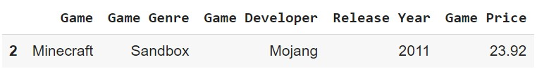

---

### Filtering (2)
We can change the values of retrieved entries.

```python
df.loc[df['Game Price'] > 20, 'Game Price'] *= 0.9
```

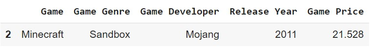

---

### Filtering (3)
We can also use the `isin()` method to check if a value is in a list.

```python
df['Game Genre'].isin(['Survival', 'Battle Royale'])
```

```python
0     True
1    False
2    False
3     True
4    False
Name: Game Genre, dtype: bool
```

---

### Filtering (4)
We can use logical operators to filter based on multiple conditions.

```python
df.loc[(df['Game Price'] < 10) & (df['Release Year'] > 2018)]
```

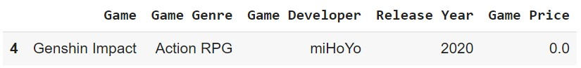

```python
df.loc[(df['Game Price'] > 20) | (df['Game Genre'] == 'Survival')]
```

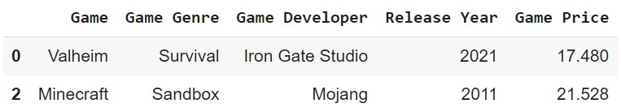

---

### Remove Duplicates
We can remove duplicate entries using the `drop_duplicates()` method. The `keep` parameter determines whether to keep the first or last entry.

```python
df2 = pd.DataFrame({'col1': [1, 1, 2, 2, 3, 3, 4, 4],
                    'col2': [1, 1, 2, 2, 3, 3, 4, 4]})
```

```python
df2.drop_duplicates(keep='first')
```

```python
   col1  col2
0     1     1
2     2     2
4     3     3
6     4     4
```

---

### Missing Values (1)
We can check for missing values using the `isnull()` method.

```python
df3 = pd.DataFrame({'col1': [1, 2, 3, np.nan],
                    'col2': [np.nan, 2, 3, 4]})
```

```python
df3.isnull()
```

```python
    col1   col2
0  False   True
1  False  False
2  False  False
3   True  False
```

---

### Missing Values (2)
We can drop missing values using the `dropna()` method.

```python
df3.dropna()
```

```python
   col1  col2
1     2     2
2     3     3
```

<div style="font-size:20px">
<b style="color:orange">Note:</b>
Don't forget to set <code>inplace=True</code> if you want to drop the missing values in the original DataFrame.
</div>

---

### Missing Values (3)
We can fill missing values using the `fillna()` method.

```python
df3.fillna(0)
```

```python
   col1  col2
0     1     0
1     2     2
2     3     3
3     0     4
```

<div style="font-size:20px">
<b style="color:orange">Note:</b>
Don't forget to set <code>inplace=True</code> if you want to fill the missing values in the original DataFrame.
</div>

---

### Missing Values (4)
A common way to fill missing values is to use a statistic such as the mean, median, or mode of the column.

```python
df3['col1'].fillna(df3['col1'].mean())
```

```python
0    1.0
1    2.0
2    3.0
3    2.0
Name: col1, dtype: float64
```

<div style="font-size:20px">
<b style="color:orange">Note:</b>
Don't forget to set <code>inplace=True</code> if you want to fill the missing values in the original DataFrame.
</div>

---

### Date and Time (1)
The `to_datetime()` method can be used to convert a column to a datetime object.

```python
df4 = pd.DataFrame({'col1': ['2019-08-02', '2020-09-25', '2023-01-03'],
                    'col2': ['2021-12-01 12:00:00', '2020-05-21 04:30:00', '2023-02-04 12:40:00']})
```

```python
df4['col1'] = pd.to_datetime(df4['col1'])
df4['col2'] = pd.to_datetime(df4['col2'])
```

```python
        col1                 col2
0 2019-08-02  2021-12-01 12:00:00
1 2020-09-25  2020-05-21 04:30:00
2 2023-01-03  2023-02-04 12:40:00
```

```python
df4.dtypes
```

```python
col1    datetime64[ns]
col2    datetime64[ns]
dtype: object
```

---

### Date and Time (2)
We can extract the year, month, day, hour, minute, and second from a datetime object.

```python
df4['col2'].dt.year
```

```python
0    2021
1    2020
2    2023
Name: col2, dtype: int64
```

```python
df4['col2'].dt.minute
```

```python
0     0
1    30
2    40
Name: col2, dtype: int64
```

---

### Date and Time (3)
A datetime object can be converted to a string using the `strftime()` method.


```python
df4['col2'].dt.strftime('%Y-%m-%d')
```

```python
0    2021-12-01
1    2020-05-21
2    2023-02-04
Name: col2, dtype: object
```

---

### Date and Time (4)
We can use the `timedelta()` method to add or subtract a number of days, hours, minutes, or seconds from a datetime object.

```python
        col1                 col2
0 2019-08-02  2021-12-01 12:00:00
1 2020-09-25  2020-05-21 04:30:00
2 2023-01-03  2023-02-04 12:40:00
```

```python
df4['col2'] + pd.Timedelta(days=1)
```

```python
0   2021-12-02 12:00:00
1   2020-05-22 04:30:00
2   2023-02-05 12:40:00
Name: col2, dtype: datetime64[ns]
```

---

### Data File I/O
Pandas can read and write data from a variety of file formats. The most common file formats are CSV, Excel, and JSON.

```python
df.to_csv('data.csv')
df.to_excel('data.xlsx')
df.to_json('data.json')
```

```python
df = pd.read_csv('data.csv')
df = pd.read_excel('data.xlsx')
df = pd.read_json('data.json')
```

---
### Read JSON Example

```json
{
    "col1": {
        "0": "A",
        "1": "B",
        "2": "C"
    },
    "col2": {
        "0": [1, 2, 3],
        "1": [4, 5, 6],
        "2": [7, 8, 9]
    }
}
```

```python
df = pd.read_json('data.json')
```

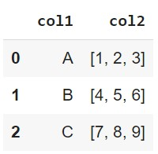

---

### Write CSV Parameters
The `to_csv()` method has a number of useful parameters. The following table shows some of the most commonly used parameters.

<div style="font-size:20px">
<table>
        <thead>
                <tr>
                        <th>Parameter</th>
                        <th>Description</th>
                </tr>
        </thead>
        <tbody>
                <tr>
                        <td><code>index</code></td>
                        <td>Write row names (index). Default is <code>True</code>.</td>
                </tr>
                <tr>
                        <td><code>header</code></td>
                        <td>Write column names. Default is <code>True</code>.</td>
                </tr>
                <tr>
                        <td><code>sep</code></td>
                        <td>Delimiter to use. Default is comma (,).</td>
                </tr>
        </tbody>
</table>
</div>

---

### Read CSV Parameters
The `read_csv()` method has a number of useful parameters. The following table shows some of the most commonly used parameters.

<div style="font-size:20px">
<table>
        <thead>
                <tr>
                        <th>Parameter</th>
                        <th>Description</th>
                </tr>
        </thead>
        <tbody>
                <tr>
                        <td><code>sep</code></td>
                        <td>Delimiter to use. Default is comma (,).</td>
                </tr>
                <tr>
                        <td><code>header</code></td>
                        <td>Row number to use as the column names. Default is <code>0</code>.</td>
                </tr>
                <tr>
                        <td><code>index_col</code></td>
                        <td>Column number to use as the index. Default is <code>None</code>.</td>
                </tr>
                <tr>
                        <td><code>skiprows</code></td>
                        <td>List of row numbers or number of rows to skip at the start of the file. Default is <code>None</code>.</td>
                </tr>
                <tr>
                        <td><code>na_values</code></td>
                        <td>Sequence of values to replace with <code>NaN</code>. Default is <code>None</code>.</td>
                </tr>
                <tr>
                        <td><code>parse_dates</code></td>
                        <td>Attempt to parse data to datetime. Default is <code>False</code>.</td>
                </tr>
                <tr>
                        <td><code>encoding</code></td>
                        <td>Text encoding to use when reading/writing the file. Default is <code>None</code>.</td>
                </tr>
        </tbody>
</table>
</div>

---

### Read CSV Example (1)

```csv
col1,col2,col3,col4
A,3,2019-01-01,الف
?,6,2019-01-02,ب
C,10,2019-01-03,N/A
```

```python
df = pd.read_csv('data.csv', na_values=['N/A', '?'],
                 parse_dates=['col4'], encoding='utf-8')
```

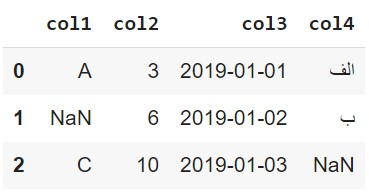

---

### Read CSV Example (2)
We can also use the `read_csv()` method to read data from a URL.

```python
imdb = pd.read_csv('https://parsa-abbasi.github.io/slides/pandas/imdb_top_250_movies.csv', index_col='rank')
```

```python
imdb.head()
```


---

### Grouping (1)
The `groupby()` method can be used to group rows of data based on one or more columns. The result of the `groupby()` method is a `DataFrameGroupBy` object.

```python
imdb.groupby('year')
```

```python
<pandas.core.groupby.generic.DataFrameGroupBy object at 0x0000020B1B5B0A90>
```

---

### Grouping (2)
The `DataFrameGroupBy` object has a number of useful methods. The following table shows some of the most commonly used methods.

<div style="font-size:20px">
<table>
        <thead>
                <tr>
                        <th>Method</th>
                        <th>Description</th>
                </tr>
        </thead>
        <tbody>
                <tr>
                        <td><code>count()</code></td>
                        <td>Number of non-NA values.</td>
                </tr>
                <tr>
                        <td><code>sum()</code></td>
                        <td>Sum of values.</td>
                </tr>
                <tr>
                        <td><code>mean()</code></td>
                        <td>Mean of values.</td>
                </tr>
                <tr>
                        <td><code>median()</code></td>
                        <td>Arithmetic median of values.</td>
                </tr>
                <tr>
                        <td><code>min()</code></td>
                        <td>Minimum.</td>
                </tr>
                <tr>
                        <td><code>max()</code></td>
                        <td>Maximum.</td>
                </tr>
                <tr>
                        <td><code>size()</code></td>
                        <td>Number of elements in the object.</td>
                </tr>
        </tbody>
</table>
</div>

---

### Grouping Example (1)

```python
imdb.groupby('year').count()['name']
```

```python
year
1921    1
1924    1
1925    1
1926    1
1927    1
       ..
2018    4
2019    6
2020    2
2021    2
2022    1
Name: name, Length: 86, dtype: int64
```

---

### Grouping Example (2)

```python
imdb.groupby('year')['rating'].mean()
```

```python
year
1921    8.30
1924    8.20
1925    8.10
1926    8.10
1927    8.30
        ... 
2018    8.35
2019    8.30
2020    8.30
2021    8.50
2022    8.30
Name: rating, Length: 86, dtype: float64
```

---

### Transforming
The `transform()` method can be used to apply a function to each group independently. The result of the `transform()` method is a `Series` object.

```python
imdb.groupby('year')['rating'].transform(lambda x: x - x.mean())
```

```python
rank
1      0.500000
2      0.000000
3      0.500000
4      0.400000
5      0.633333
         ...   
246   -0.140000
247   -0.060000
248   -0.166667
249   -0.100000
250   -0.350000
Name: rating, Length: 250, dtype: float64
```

---

### Merge / Join
The `merge()` method can be used to join two `DataFrame` objects. The following table shows some of the most commonly used parameters.

<div style="font-size:20px">
<table>
        <thead>
                <tr>
                        <th>Parameter</th>
                        <th>Description</th>
                </tr>
        </thead>
        <tbody>
                <tr>
                        <td><code>left</code></td>
                        <td>Left `DataFrame` object.</td>
                </tr>
                <tr>
                        <td><code>right</code></td>
                        <td>Right `DataFrame` object.</td>
                </tr>
                <tr>
                        <td><code>how</code></td>
                        <td>One of <code>left</code>, <code>right</code>, <code>outer</code>, <code>inner</code>, <code>cross</code>. Default is <code>inner</code>.</td>
                </tr>
                <tr>
                        <td><code>on</code></td>
                        <td>Column(s) to join on. Must be found in both the left and right `DataFrame` objects.</td>
                </tr>
                <tr>
                        <td><code>left_on</code></td>
                        <td>Column(s) in the left `DataFrame` to use as the join keys.</td>
                </tr>
                <tr>
                        <td><code>right_on</code></td>
                        <td>Column(s) in the right `DataFrame` to use as the join keys.</td>
                </tr>
                <tr>
                        <td><code>left_index</code></td>
                        <td>Use the index from the left `DataFrame` as its join key(s). Default is <code>False</code>.</td>
                </tr>
                <tr>
                        <td><code>right_index</code></td>
                        <td>Use the index from the right `DataFrame` as its join key(s). Default is <code>False</code>.</td>
                </tr>
        </tbody>
</table>
</div>

---

### Merge How Parameter (1)
The following table shows some of the most commonly used values for the `how` parameter.

<div style="font-size:20px">
<table>
        <thead>
                <tr>
                        <th>Value</th>
                        <th>Description</th>
                </tr>
        </thead>
        <tbody>
                <tr>
                        <td><code>inner</code></td>
                        <td>Use intersection of keys from both `DataFrame` objects.</td>
                </tr>
                <tr>
                        <td><code>left</code></td>
                        <td>Use only keys from left `DataFrame` object.</td>
                </tr>
                <tr>
                        <td><code>right</code></td>
                        <td>Use only keys from right `DataFrame` object.</td>
                </tr>
                <tr>
                        <td><code>outer</code></td>
                        <td>Use union of keys from both `DataFrame` objects.</td>
                </tr>
                <tr>
                        <td><code>cross</code></td>
                        <td>Use cartesian product with each row from the left `DataFrame` object being paired with each row from the right `DataFrame` object.</td>
                </tr>
        </tbody>
</table>
</div>

---

### Merge How Parameter (2)

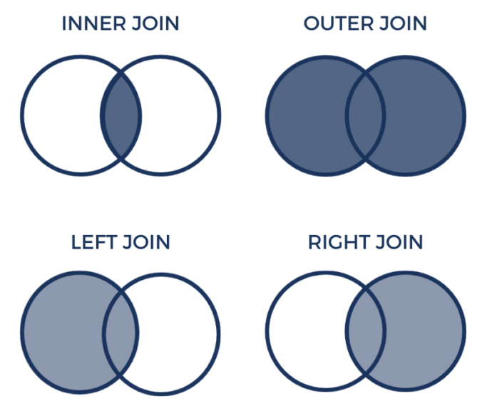
<div style="font-size:16px">
<b>Source:</b>
<a href="https://datagy.io/pandas-merge-concat/">datagy</a>
</div>

---

### Inner Join


```python
df1 = pd.DataFrame({'City': ['Amsterdam', 'Tilburg', 'Rotterdam', 'Utrecht'],
                    'Population': [821752, 213310, 623652, 340852]})
df2 = pd.DataFrame({'City': ['Rotterdam', 'Nijmegen', 'Eindhoven', 'Tilburg', 'Utrecht'],
                    'Area': [41.78, 32.61, 213.31, 37.29, 30.93]})
```

```python
pd.merge(df1, df2, how='inner', on='City')
```

```python
        City  Population   Area
0    Tilburg      213310  37.29
1  Rotterdam      623652  41.78
2    Utrecht      340852  30.93
```

<div style="font-size:20px">
<b style="color:orange">Note:</b>
As you can see, only the cities that are present in both <code>df1</code> and <code>df2</code> are included in the result.
</div>

---

### Left Join

```python
df1 = pd.DataFrame({'City': ['Amsterdam', 'Tilburg', 'Rotterdam', 'Utrecht'],
                    'Population': [821752, 213310, 623652, 340852]})
df2 = pd.DataFrame({'City': ['Rotterdam', 'Nijmegen', 'Eindhoven', 'Tilburg', 'Utrecht'],
                    'Area': [41.78, 32.61, 213.31, 37.29, 30.93]})
```

```python
pd.merge(df1, df2, how='left', on='City')
```

```python
        City  Population   Area
0  Amsterdam      821752    NaN
1    Tilburg      213310  37.29
2  Rotterdam      623652  41.78
3    Utrecht      340852  30.93
```

<div style="font-size:20px">
<b style="color:orange">Note:</b>
As you can see, all cities from <code>df1</code> are included in the result, even if they are not present in <code>df2</code>. The missing values are filled with <code>NaN</code>.
</div>

---

### Right Join

```python
df1 = pd.DataFrame({'City': ['Amsterdam', 'Tilburg', 'Rotterdam', 'Utrecht'],
                    'Population': [821752, 213310, 623652, 340852]})
df2 = pd.DataFrame({'City': ['Rotterdam', 'Nijmegen', 'Eindhoven', 'Tilburg', 'Utrecht'],
                    'Area': [41.78, 32.61, 213.31, 37.29, 30.93]})
```

```python
pd.merge(df1, df2, how='right', on='City')
```

```python
        City  Population    Area
0  Rotterdam    623652.0   41.78
1   Nijmegen         NaN   32.61
2  Eindhoven         NaN  213.31
3    Tilburg    213310.0   37.29
4    Utrecht    340852.0   30.93
```

<div style="font-size:20px">
<b style="color:orange">Note:</b>
As you can see, all cities from <code>df2</code> are included in the result, even if they are not present in <code>df1</code>. The missing values are filled with <code>NaN</code>.
</div>

---

### Outer Join

```python
df1 = pd.DataFrame({'City': ['Amsterdam', 'Tilburg', 'Rotterdam', 'Utrecht'],
                    'Population': [821752, 213310, 623652, 340852]})
df2 = pd.DataFrame({'City': ['Rotterdam', 'Nijmegen', 'Eindhoven', 'Tilburg', 'Utrecht'],
                    'Area': [41.78, 32.61, 213.31, 37.29, 30.93]})
```

```python
pd.merge(df1, df2, how='outer', on='City')
```

```python
        City  Population    Area
0  Amsterdam    821752.0     NaN
1    Tilburg    213310.0   37.29
2  Rotterdam    623652.0   41.78
3    Utrecht    340852.0   30.93
4   Nijmegen         NaN   32.61
5  Eindhoven         NaN  213.31
```

<div style="font-size:20px">
<b style="color:orange">Note:</b>
As you can see, all cities from both <code>df1</code> and <code>df2</code> are included in the result. The missing values are filled with <code>NaN</code>.
</div>

---

### Cross Join

```python
df1 = pd.DataFrame({'City': ['Amsterdam', 'Tilburg', 'Rotterdam', 'Utrecht'],
                    'Population': [821752, 213310, 623652, 340852]})
df2 = pd.DataFrame({'City': ['Rotterdam', 'Nijmegen', 'Eindhoven', 'Tilburg', 'Utrecht'],
                    'Area': [41.78, 32.61, 213.31, 37.29, 30.93]})
```

```python
pd.merge(df1, df2, how='cross')
```

```python
City_x  Population City_y   Area
       City_x  Population     City_y    Area
0   Amsterdam      821752  Rotterdam   41.78
1   Amsterdam      821752   Nijmegen   32.61
2   Amsterdam      821752  Eindhoven  213.31
3   Amsterdam      821752    Tilburg   37.29
4   Amsterdam      821752    Utrecht   30.93
5     Tilburg      213310  Rotterdam   41.78
6     Tilburg      213310   Nijmegen   32.61
...
```

<div style="font-size:20px">
<b style="color:orange">Note:</b>
As you can see, all possible combinations of cities from both <code>df1</code> and <code>df2</code> are included in the result. The missing values are filled with <code>NaN</code>.
</div>

---

### Concatenatination (1)
The <code>concat()</code> function is used to concatenate two or more DataFrames.

```python
df1 = pd.DataFrame({'City': ['Amsterdam', 'Tilburg', 'Rotterdam', 'Utrecht'],
                    'Population': [821752, 213310, 623652, 340852]})
df2 = pd.DataFrame({'City': ['Eindhoven', 'Nijmegen', 'Groningen'],
                    'Population': [223452, 165432, 248563]})
```

```python
pd.concat([df1, df2])
```

```python
        City  Population
0  Amsterdam      821752
1    Tilburg      213310
2  Rotterdam      623652
3    Utrecht      340852
0  Eindhoven      223452
1   Nijmegen      165432
2  Groningen      248563
```

---

### Concatenatination (2)
We can also concatenate DataFrames along the columns.

```python
df1 = pd.DataFrame({'City': ['Amsterdam', 'Tilburg', 'Rotterdam', 'Utrecht'],
                    'Population': [821752, 213310, 623652, 340852]})
df2 = pd.DataFrame({'Area': [41.78, 32.61, 213.31, 37.29, 30.93],
                    'Density': [19857, 6554, 2954, 9123, 10000]})
```

```python
pd.concat([df1, df2], axis=1)
```

```python
        City  Population    Area  Density
0  Amsterdam    821752.0   41.78    19857
1    Tilburg    213310.0   32.61     6554
2  Rotterdam    623652.0  213.31     2954
3    Utrecht    340852.0   37.29     9123
4        NaN         NaN   30.93    10000
```

---

### Manipulating Text Data (1)
The <code>str</code> attribute of a Series provides access to a set of string manipulation methods.

```python
df = pd.DataFrame({'City': ['Amsterdam', 'Tilburg', 'The Hague'],
                   'Province': ['North Holland', 'North Brabant', 'South Holland']})
```

```python
df['City'].str.upper()
```

```python
0    AMSTERDAM
1      TILBURG
2    THE HAGUE
Name: City, dtype: object
```

```python
df['City'].str.lower()
```

```python
0    amsterdam
1      tilburg
2    the hague
Name: City, dtype: object
```

---

### Manipulating Text Data (2)

```python
df['City'].str.len()
```

```python
0    9
1    7
2    9
Name: City, dtype: int64
```


```python
df['Province'].str.contains('Holland')
```

```python
0     True
1    False
2     True
Name: Province, dtype: bool
```

---

### Manipulating Text Data (3)

```python
df['City'].str.replace('The Hague', 'Den Haag')
```

```python
0    Amsterdam
1      Tilburg
2     Den Haag
Name: City, dtype: object
```

```python
df['Province'].str.split(' ')
```

```python
0    [North, Holland]
1    [North, Brabant]
2    [South, Holland]
Name: Province, dtype: object
```

---

### Correlation
The <code>corr()</code> function is used to compute pairwise correlation of columns.

```python
df = pd.DataFrame({'Population': [821752, 213310, 623652, 340852, 223452, 165432, 248563],
                   'Area': [41.78, 32.61, 213.31, 37.29, 30.93, 32.61, 213.31],
                   'Density': [19857, 6554, 2954, 9123, 10000, 6554, 2954]})
```

```python
df.corr()
```

```python
            Population      Area   Density
Population    1.000000  0.197199  0.564658
Area          0.197199  1.000000 -0.602733
Density       0.564658 -0.602733  1.000000
```

<div style="font-size:20px">
<b style="color:orange">Note:</b>
As you can see, the correlation between <code>Density</code> and <code>Population</code> is positive, while the correlation between <code>Density</code> and <code>Area</code> is negative. This is because the density of a city is inversely proportional to the area of the city and directly proportional to the population of the city.
</div>

---

### Resampling (1)
Resampling is a data aggregation task that involves grouping data into time intervals and applying a function to each group.

```python
df = pd.DataFrame({'Date': ['2022-01-01', '2022-01-02', '2022-01-03', '2022-01-04', '2022-01-05', '2022-01-06', '2022-01-07'],
                   'Temperature': [5.3, 3.8, 2.1, 1.2, 0.5, 1.8, 3.1]})
```

```python
```

```python
df['Date'] = pd.to_datetime(df['Date'])
```

```python
df = df.set_index('Date')
```

---

### Resampling (2)
The <code>resample()</code> function is used to resample the DataFrame.

```python
df.resample('2D').mean()
```

```python
            Temperature
Date                   
2022-01-01         4.55
2022-01-03         1.65
2022-01-05         1.15
2022-01-07         3.10
```

```python
df.resample('M').max()
```

```python
            Temperature
Date                   
2022-01-31          5.3
```

---

## Finishing Up
Thank you for keeping up with me until the end!

If you have any questions or suggestions, please send me an email at [parsa.abbasi1996@gmail.com](mailto:parsa.abbasi1996@gmail.com?subject=Mail%20about%20numpy).
