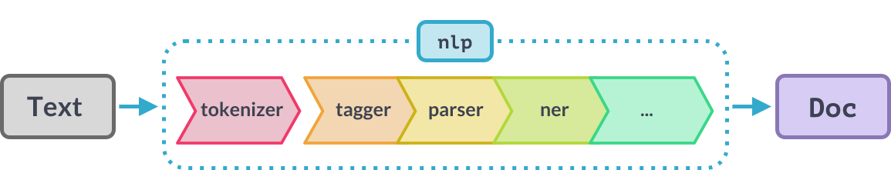

## Definition

### Natural Langauge

Natural language refers to the language that humans use for communication (to express thoughts, feelings, and ideas), such as English, Dutch, or Persian, as opposed to a *formal* language, such as a computer programming language.

### Formal Language

A formal language is a language that is defined by a set of rules that describe how to write, read, and interpret the language. 
These languages are defined in such a strict way that is always possible to determine whether a given string of characters is a valid sentence in the language or not.


When you run a compiler or an interpreter on the code you write in a programming language, you either get a syntax error or not. The compiler won't say something like "Hmm, this code is maybe 50% grammatically correct".


### Natural Language Ambiguity

Human languages are ambiguous. The same sentence can have multiple meanings depending on the context.

```
He saw a girl with a telescope.
```

```
I saw a bat.
```

```
She told her brother she would call him today.
```

```
I will meet you at the bank tomorrow.
```

### Natural Language Processing

Natural Language Processing (**NLP**) is a field of computer science, artificial intelligence, and computational linguistics concerned with the interactions between computers and human (natural) languages.


### Natural Language Understanding

Natural Language Understanding (**NLU**) is a subtopic of NLP that focuses on the tasks of understanding and interpreting the meaning of language. These systems use a combination of NLP and machine learning algorithms to derive meaning from an input sentence.

### Nautral Language Generation

Natural Language Generation (**NLG**) is a subtopic of NLP that focuses on the tasks of generating natural language from structured data. These systems use a combination of NLP and machine learning algorithms to generate text that is as close as possible to human-written text.


### Differences

- NLP is focused on <u>processing</u> and <u>analyzing</u> natural language data.
- NLU is focused on <u>understanding</u> and <u>interpreting</u> the meaning of natural language data.
- NLG is focused on <u>generating</u> natural language output.


### Common Terms

- **Corpus ($C$)**: A collection of text documents.
- **Document ($D$)**: A single text record of the corpus.
- **Word ($w$)**: A single word in a document.
- **Token ($t$)**: An instance of a sequence of characters in a document that are grouped together as a useful semantic unit for processing.
- **Vocabulary ($V$)**: The set of all unique words/tokens present in the corpus.


## Tokenization

The main tool for preprocessing textual data is a tokenizer. A tokenizer is a function that takes a string as input and splits text into tokens according to a set of rules.


### Word-based Tokenizers

Splitting a text into smaller chunks is harder than it seems. For example, how would you split the following text into tokens?

```
Don't you love 🤗 Transformers? We sure do.
```

A simple approach would be to split the text by whitespace characters.

```python
["Don't", "you", "love", "🤗", "Transformers?", "We", "sure", "do."]
```

### Tokenization Challanges

- Can't just blindly remove punctuation: Ph.D., AT&T
- Clitics: a part of a word that can't stand on its own: we're -> we are
- Multiword Expressions (MWE): New York, rock ’n’ roll 

### Punctuation

We should take the punctuation into account so that a model does not have to learn a different representation of a word and every possible punctuation symbol that could follow it.

```python
["Don't", "you", "love", "🤗", "Transformers?", "We", "sure", "do."]
```

```python
["Don", "'", "t", "you", "love", "🤗", "Transformers", "?", "We", "sure", "do", "."]
```

```python
["Don", "'", "t", "you", "love", "🤗", "Transformers", "?", "We", "sure", "do", "."]
```

Look how the tokenization dealt with the word <u>`Don't`</u>. It split the word into three tokens! <u>`Don't`</u> stands for <u>`Do not`</u>, but the tokenizer doesn't know that. It would be better if the tokenizer could split the word into two tokens: <u>`Do`</u> and <u>`n't`</u>.


### NLTK Tokenizer

To handle this kind of challanges, each library has its own procedure of how to tokenize a text.
NLTK is a popular Python library for NLP. It has a advanced word tokenizer that can handle the above example.

```python
from nltk.tokenize import word_tokenize
text = "Don't you love 🤗 Transformers? We sure do."
word_tokenize(text)
```

```python
['Do', "n't", 'you', 'love', '🤗', 'Transformers', '?', 'We', 'sure', 'do', '.']
```

### spaCy Tokenizer

spaCy is another popular and powerful Python library for NLP. We will use the `tokenizer()` function to tokenize the text. It will split the raw text on whitespace character (similar to `text.split(' ')`) and then the tokenizer processes the text from left to right. 

On each substring, it performs two checks:

1) Does the substring match a tokenizer exception rule? (<u>`don't`</u> and <u>`U.K.`</u>)

2) Can a prefix, suffix or infix be split off? (such as punctuations)

<center>


<div style="font-size:14px">
<b>Image source:</b>
<i><a href="https://spacy.io/usage/linguistic-features#how-tokenizer-works" target="_blank">https://spacy.io/usage/linguistic-features#how-tokenizer-works</a></i>
</div>
</center>

```python
import spacy
nlp = spacy.load("en_core_web_sm")
text = "Don't you love 🤗 Transformers? We sure do."
doc = nlp(text)
tokens = [token.text for token in doc]

print(doc)
print(type(doc))
print(tokens)
```

```
Don't you love 🤗 Transformers? We sure do.
<class 'spacy.tokens.doc.Doc'>
['Do', "n't", 'you', 'love', '🤗', 'Transformers', '?', 'We', 'sure', 'do', '.']
```


### How many words?

Herdan's law states that the number of words/types in a language (vocabular size) is proportional to the square root of the number of different word tokens.

$ |V| = kN^\beta $

$ 0.67 < \beta < 0.75 $

Word-based tokenizer generates a very big vocabulary (the set of all unique words and tokens used).

<div style="font-size:20px">
<table>
  <thead>
    <tr>
      <th>Corpus</th>
      <th>Tokens = $N$</th>
      <th>Types = $|V|$</th>
    </tr>
  </thead>
  <tbody>
    <tr>
      <td><a href="https://catalog.ldc.upenn.edu/LDC97S62" target="_blank">Switchboard phone conversations</a></td>
      <td>2.4 million</td>
      <td>20 thousand</td>
    </tr>
    <tr>
      <td><a href="https://lexically.net/wordsmith/support/shakespeare.html" target="_blank">Shakespeare</a></td>
      <td>884,000</td>
      <td>31 thousand</td>
    </tr>
    <tr>
      <td><a href="https://www.english-corpora.org/coca/" target="_blank">COCA</a></td>
      <td>440 million</td>
      <td>2 million</td>
    </tr>
    <tr>
      <td><a href="https://commondatastorage.googleapis.com/books/syntactic-ngrams/index.html" target="_blank">Google N-grams</a></td>
      <td>1 trillion</td>
      <td>13+ million</td>
    </tr>
  </tbody>
</table>
</div>

### Character-based Tokenizers

Why not simply tokenize on characters? It's a simple approach and it greatly reduces the vocabulary size. But, it is much harder for a model to learn meaningful representations of input text.

```python
text = "Don't you love 🤗 Transformers? We sure do."
tokens = list(text)
print(tokens)
```

```python
['D', 'o', 'n', "'", 't', ' ', 'y', 'o', 'u', ' ', 'l', 'o', 'v', 'e', ' ', '🤗', ' ', 'T', 'r', 'a', 'n', 's', 'f', 'o', 'r', 'm', 'e', 'r', 's', '?', ' ', 'W', 'e', ' ', 's', 'u', 'r', 'e', ' ', 'd', 'o', '.']
```

Why not get the best of both worlds (word-based and character-based tokenization)? Many modern models (specifically, Transformer-based models) use subword tokenization.

Subword tokenization rely on the following principles:
- Frequent words should not be split into smaller subwords.
- Rare words should be decomposed into meaningful subwords.

For instance, "absurdly" is a rare word and could be decomposed into "absurd" and "ly". But, "absurd" and "ly" are more frequent while at the same time the meaning of "absurdly" is kept by combining the two subwords.

Many languages have a large number of words that are composed of multiple meaningful subwords. "Lebensversicherungsgesellschaftsangestellter" means "life insurance company employee" in German.

Subword tokenization allows the model to:

- have a reasonably sized vocabulary
- being able to learn meaningful context-independent representations of words
- being able to process words that are not in the vocabulary, by decomposing them into known subwords

### 🤗 Tokenizers

Hugging Face is a platform that provides state-of-the-art NLP technologies. Each model in the [Hugging Face Model Hub](https://huggingface.co/models) is accompanied by a tokenizer. The tokenizer is responsible for preprocessing the text, splitting it into tokens and mapping tokens to token IDs. To mark some special tokens, the tokenizer also adds special tokens to the sequence.

#### BertTokenizer - Uncased

```python
from transformers import BertTokenizer
tokenizer = BertTokenizer.from_pretrained('bert-base-uncased')
text = "US orders immediate halt to some AI chip exports to China, Nvidia says"
tokens = tokenizer.tokenize(text)
print(tokens)
```

```python
['us', 'orders', 'immediate', 'halt', 'to', 'some', 'ai', 'chip', 'exports', 'to', 'china', ',', 'n', '##vid', '##ia', 'says']
```

#### BertTokenizer - Cased

```python
from transformers import BertTokenizer
tokenizer = BertTokenizer.from_pretrained('bert-base-cased')
text = "US orders immediate halt to some AI chip exports to China, Nvidia says"
tokens = tokenizer.tokenize(text)
print(tokens)
```

```python
['US', 'orders', 'immediate', 'halt', 'to', 'some', 'AI', 'chip', 'exports', 'to', 'China', ',', 'N', '##vid', '##ia', 'says']
```

### Byte-Pair Encoding (BPE)

BPE uses the data to tell us how to tokenize.

It consists of two parts:

- A token **learner**: takes a raw training corpus and outputs a vocabulary of subword units (tokens).
- A token **segmenter**: takes a raw test sentence and tokenizes it according to the vocabulary.


#### BPE learner

<center>

</center>

#### BPE Example

Corpus:

```python
"low low low low low lowest lowest newer newer newer newer newer newer wider wider wider new new "
```

Corpus representation:

<div style="font-size:20px">
<table>
  <tbody>
    <tr>
      <td>5</td>
      <td>l o w _</td>
    </tr>
    <tr>
      <td>2</td>
      <td>l o w e s t _</td>
    </tr>
    <tr>
      <td>6</td>
      <td>n e w e r _</td>
    </tr>
    <tr>
      <td>3</td>
      <td>w i d e r _</td>
    </tr>
    <tr>
      <td>3</td>
      <td>n e w _</td>
    </tr>
  </tbody>
</table>
</div>

##### Iteration 1

```python
['_', 'd', 'e', 'i', 'l', 'n', 'o', 'r', 's', 't', 'w']
```

<div style="font-size:20px">
<table>
  <tbody>
    <tr>
      <td>5</td>
      <td>l o w _</td>
    </tr>
    <tr>
      <td>2</td>
      <td>l o w e s t _</td>
    </tr>
    <tr>
      <td>6</td>
      <td>n e w e r _</td>
    </tr>
    <tr>
      <td>3</td>
      <td>w i d e r _</td>
    </tr>
    <tr>
      <td>3</td>
      <td>n e w _</td>
    </tr>
  </tbody>
</table>
</div>

```python
['_', 'd', 'e', 'i', 'l', 'n', 'o', 'r', 's', 't', 'w', 'er']
```

<div style="font-size:20px">
<table>
  <tbody>
    <tr>
      <td>5</td>
      <td>l o w _</td>
    </tr>
    <tr>
      <td>2</td>
      <td>l o w e s t _</td>
    </tr>
    <tr>
      <td>6</td>
      <td>n e w <span style="color:red">er</span> _</td>
    </tr>
    <tr>
      <td>3</td>
      <td>w i d <span style="color:red">er</span> _</td>
    </tr>
    <tr>
      <td>3</td>
      <td>n e w _</td>
    </tr>
  </tbody>
</table>
</div>


##### Iteration 2

```python
['_', 'd', 'e', 'i', 'l', 'n', 'o', 'r', 's', 't', 'w', 'er']
```

<div style="font-size:20px">
<table>
  <tbody>
    <tr>
      <td>5</td>
      <td>l o w _</td>
    </tr>
    <tr>
      <td>2</td>
      <td>l o w e s t _</td>
    </tr>
    <tr>
      <td>6</td>
      <td>n e w er _</td>
    </tr>
    <tr>
      <td>3</td>
      <td>w i d er _</td>
    </tr>
    <tr>
      <td>3</td>
      <td>n e w _</td>
    </tr>
  </tbody>
</table>
</div>


```python
['_', 'd', 'e', 'i', 'l', 'n', 'o', 'r', 's', 't', 'w', 'er', 'er_']
```

<div style="font-size:20px">
<table>
  <tbody>
    <tr>
      <td>5</td>
      <td>l o w _</td>
    </tr>
    <tr>
      <td>2</td>
      <td>l o w e s t _</td>
    </tr>
    <tr>
      <td>6</td>
      <td>n e w <span style="color:red">er_</span></td>
    </tr>
    <tr>
      <td>3</td>
      <td>w i d <span style="color:red">er_</span></td>
    </tr>
    <tr>
      <td>3</td>
      <td>n e w _</td>
    </tr>
  </tbody>
</table>
</div>


##### Iteration 3

```python
['_', 'd', 'e', 'i', 'l', 'n', 'o', 'r', 's', 't', 'w', 'er', 'er_']
```

<div style="font-size:20px">
<table>
  <tbody>
    <tr>
      <td>5</td>
      <td>l o w _</td>
    </tr>
    <tr>
      <td>2</td>
      <td>l o w e s t _</td>
    </tr>
    <tr>
      <td>6</td>
      <td>n e w er_</td>
    </tr>
    <tr>
      <td>3</td>
      <td>w i d er_</td>
    </tr>
    <tr>
      <td>3</td>
      <td>n e w _</td>
    </tr>
  </tbody>
</table>
</div>


```python
['_', 'd', 'e', 'i', 'l', 'n', 'o', 'r', 's', 't', 'w', 'er', 'er_', 'ne']
```

<div style="font-size:20px">
<table>
  <tbody>
    <tr>
      <td>5</td>
      <td>l o w _</td>
    </tr>
    <tr>
      <td>2</td>
      <td>l o w e s t _</td>
    </tr>
    <tr>
      <td>6</td>
      <td><span style="color:red">ne</span> w er_</td>
    </tr>
    <tr>
      <td>3</td>
      <td>w i d er_</td>
    </tr>
    <tr>
      <td>3</td>
      <td><span style="color:red">ne</span> w _</td>
    </tr>
  </tbody>
</table>
</div>


##### Iteration 4

```python
['_', 'd', 'e', 'i', 'l', 'n', 'o', 'r', 's', 't', 'w', 'er', 'er_', 'ne']
```

<div style="font-size:20px">
<table>
  <tbody>
    <tr>
      <td>5</td>
      <td>l o w _</td>
    </tr>
    <tr>
      <td>2</td>
      <td>l o w e s t _</td>
    </tr>
    <tr>
      <td>6</td>
      <td>ne w er_</td>
    </tr>
    <tr>
      <td>3</td>
      <td>w i d er_</td>
    </tr>
    <tr>
      <td>3</td>
      <td>ne w _</td>
    </tr>
  </tbody>
</table>
</div>


```python
['_', 'd', 'e', 'i', 'l', 'n', 'o', 'r', 's', 't', 'w', 'er', 'er_', 'ne', 'new']
```

<div style="font-size:20px">
<table>
  <tbody>
    <tr>
      <td>5</td>
      <td>l o w _</td>
    </tr>
    <tr>
      <td>2</td>
      <td>l o w e s t _</td>
    </tr>
    <tr>
      <td>6</td>
      <td><span style="color:red">new</span> er_</td>
    </tr>
    <tr>
      <td>3</td>
      <td>w i d er_</td>
    </tr>
    <tr>
      <td>3</td>
      <td><span style="color:red">new</span> _</td>
    </tr>
  </tbody>
</table>
</div>


##### After Iteration 8

```python
['_', 'd', 'e', 'i', 'l', 'n', 'o', 'r', 's', 't', 'w', 'er', 'er_', 'ne', 'new', 'lo', 'low', 'newer_', 'low_']
```

<div style="font-size:20px">
<table>
  <tbody>
    <tr>
      <td>5</td>
      <td>low_</td>
    </tr>
    <tr>
      <td>2</td>
      <td>low e s t _</td>
    </tr>
    <tr>
      <td>6</td>
      <td>newer_</td>
    </tr>
    <tr>
      <td>3</td>
      <td>w i d er_</td>
    </tr>
    <tr>
      <td>3</td>
      <td>new _</td>
    </tr>
  </tbody>
</table>
</div>


#### BPE Segmenter

On the test sentence, run each learned merge operation <u>greedily</u>.

```python
['_', 'd', 'e', 'i', 'l', 'n', 'o', 'r', 's', 't', 'w', 'er', 'er_', 'ne', 'new', 'lo', 'low', 'newer_', 'low_']
```

- "n e w e r _" → "newer\_" (full word)
- "l o w e r _" → "low er\_" (two tokens)

#### Properties of BPE tokens

The resulting tokens have the following properties:

- Usually include frequent words
- And frequent subwords which are often morphemes like *-est* or *-er* or *-ing*

<div style="font-size:22px; margin-top:30px">
A <b>morpheme</b> is the smallest meaning-bearing unit of a language
<br>
For example, <i>unlikeliest</i> has 3 morphemes: <i>un-</i>, <i>likely</i> and <i>-est</i>
</div>


### tiktoken

[tiktoken](https://github.com/openai/tiktoken) is a tokenizer that uses BPE to tokenize text. It is a fast and memory-efficient tokenizer which is used with OpenAI's models.

```python
from tiktoken import encoding_for_model
enc = encoding_for_model("gpt-4")
text = "Models don't see text like you and I, instead they see a sequence of numbers (known as tokens)."
encodings = enc.encode(text)
print(encodings)
decode = [enc.decode_single_token_bytes(token).decode('utf-8') for token in encodings]
print(decode)
assert enc.decode(enc.encode(text)) == text
```

```python
[17399, 1541, 956, 1518, 1495, 1093, 499, 323, 358, 11, 4619, 814, 1518, 264, 8668, 315, 5219, 320, 5391, 439, 11460, 570]
['Models', ' don', "'t", ' see', ' text', ' like', ' you', ' and', ' I', ',', ' instead', ' they', ' see', ' a', ' sequence', ' of', ' numbers', ' (', 'known', ' as', ' tokens', ').']
```


## Stop words

Stop words are a set of commonly used words in a language, but they carry very little useful information. They are <u>usually</u> removed from the text before further processing.

**🤔 Can we <u>always</u> remove stop words? Why not?**

What if we are trying to predict the sentiment of a text and the text contains the word ‍`not‍`?
For example, `I am not happy` and `I am happy` have opposite meanings. If we remove the word `not`, we will lose this information.
So, we need to be careful when removing stop words.

```python
from nltk.corpus import stopwords
from nltk.tokenize import word_tokenize

stop_words = set(stopwords.words('english'))

text = "There is no single universal list of stop words used by all natural language processing tools, nor any agreed upon rules for identifying stop words, and indeed not all tools even use such a list."

tokens = word_tokenize(text)

print('Tokens:', tokens)
print('Stop words:', [word for word in tokens if word in stop_words])
print('Remaining tokens:', [word for word in tokens if word not in stop_words])
```

```python
Tokens: ['There', 'is', 'no', 'single', 'universal', 'list', 'of', 'stop', 'words', 'used', 'by', 'all', 'natural', 'language', 'processing', 'tools', ',', 'nor', 'any', 'agreed', 'upon', 'rules', 'for', 'identifying', 'stop', 'words', ',', 'and', 'indeed', 'not', 'all', 'tools', 'even', 'use', 'such', 'a', 'list', '.']
Stop words: ['is', 'no', 'of', 'by', 'all', 'nor', 'any', 'for', 'and', 'not', 'all', 'such', 'a']
Remaining tokens: ['There', 'single', 'universal', 'list', 'stop', 'words', 'used', 'natural', 'language', 'processing', 'tools', ',', 'agreed', 'upon', 'rules', 'identifying', 'stop', 'words', ',', 'indeed', 'tools', 'even', 'use', 'list', '.']
```

```python
import spacy

nlp = spacy.load("en_core_web_sm")

text = "There is no single universal list of stop words used by all natural language processing tools, nor any agreed upon rules for identifying stop words, and indeed not all tools even use such a list."

tokens = nlp(text)

print('Tokens:', [token.text for token in tokens])
print('Stop words:', [token.text for token in tokens if token.is_stop])
print('Remaining tokens:', [token.text for token in tokens if not token.is_stop])
```

```python
Tokens: ['There', 'is', 'no', 'single', 'universal', 'list', 'of', 'stop', 'words', 'used', 'by', 'all', 'natural', 'language', 'processing', 'tools', ',', 'nor', 'any', 'agreed', 'upon', 'rules', 'for', 'identifying', 'stop', 'words', ',', 'and', 'indeed', 'not', 'all', 'tools', 'even', 'use', 'such', 'a', 'list', '.']
Stop words: ['There', 'is', 'no', 'of', 'used', 'by', 'all', 'nor', 'any', 'upon', 'for', 'and', 'indeed', 'not', 'all', 'even', 'such', 'a']
Remaining tokens: ['single', 'universal', 'list', 'stop', 'words', 'natural', 'language', 'processing', 'tools', ',', 'agreed', 'rules', 'identifying', 'stop', 'words', ',', 'tools', 'use', 'list', '.']
```

## Number Normalization

Should we treat each number as a separate token? If so, we will have a very big vocabulary. On the other hand, if remove or replace the numbers, we will lose some information.
We can replace the number with a special token, such as `<NUM>`. But in a task like question answering, we need to keep the number as it is. 

```
What is the price for iPhone 12?
```

```
What is the price for iPhone <NUM>?
```

## Stemming & Lemmatization

For grammatical reasons, documents are going to use different forms of a word, such as `organize`, `organizes`, and `organizing`.

Additionally, there are families of derivationally related words with similar meanings, such as `democracy`, `democratic`, and `democratization`.

The goal of both stemming and lemmatization is to reduce inflectional forms and sometimes derivationally related forms of a word to a common base form. For instance:

- `am`, `are`, `is` $\Rightarrow$ `be`

- `car`, `cars`, `car's`, `cars'` $\Rightarrow$ `car`


**Stemming** usually refers to a crude heuristic process that chops off the ends of words in the hope of achieving this goal correctly most of the time, and often includes the removal of derivational affixes.

**Lemmatization** usually refers to doing things properly with the use of a vocabulary and morphological analysis of words, normally aiming to remove inflectional endings only and to return the base or dictionary form of a word, which is known as the lemma 

If confronted with the token `saw`:
 
- **Stemming** might return just `s`
- **Lemmatization** would attempt to return either `see` or `saw` depending on whether the use of the token was as a verb or a noun.

Consider an information retrieval system where queries are matched against documents. One of the steps is to normalize the words in both the query and the document. For example, the words `organize`, `organizes`, and `organizing` might all be stemmed to the same root word `organiz`.

🤔 What is the influence of stemming on precision and recall?

- **Precision**: The fraction of retrieved documents that are relevant to the query ($TP / (TP + FP)$).
- **Recall**: The fraction of relevant documents that are successfully retrieved ($TP / (TP + FN)$).

Stemming usually decreases precision and increases recall.

- Stemming increases recall by mapping variants of words to their common root form, which allows the system to retrieve more relevant documents that contain different inflectional forms of a word

- On the other hand, stemming can harm precision by introducing ambiguity and merging words with different meanings into the same root form. This can lead to a <u>higher number of false positives</u>, where the system retrieves irrelevant documents that share the same stemmed root with the query.


```python
from nltk.tokenize import word_tokenize
from nltk.stem import PorterStemmer
from nltk.stem import WordNetLemmatizer

ps = PorterStemmer()
wn = WordNetLemmatizer()

text = "But in the end it's only a passing thing, this shadow; even darkness must pass."

tokens = word_tokenize(text)

print('Tokens:', tokens)
print('Stemmed tokens:', [ps.stem(token) for token in tokens])
print('Lemmatized tokens:', [wn.lemmatize(token) for token in tokens])
```

```python
Tokens: ['But', 'in', 'the', 'end', 'it', "'s", 'only', 'a', 'passing', 'thing', ',', 'this', 'shadow', ';', 'even', 'darkness', 'must', 'pass', '.']
Stemmed tokens: ['but', 'in', 'the', 'end', 'it', "'s", 'onli', 'a', 'pass', 'thing', ',', 'thi', 'shadow', ';', 'even', 'dark', 'must', 'pass', '.']
Lemmatized tokens: ['But', 'in', 'the', 'end', 'it', "'s", 'only', 'a', 'passing', 'thing', ',', 'this', 'shadow', ';', 'even', 'darkness', 'must', 'pas', '.']
```

```python
import spacy

nlp = spacy.load("en_core_web_sm")

text = "But in the end it's only a passing thing, this shadow; even darkness must pass."

tokens = nlp(text)

print('Tokens:', [token.text for token in tokens])
print('Lemmatized tokens:', [token.lemma_ for token in tokens])
```

```python
Tokens: ['But', 'in', 'the', 'end', 'it', "'s", 'only', 'a', 'passing', 'thing', ',', 'this', 'shadow', ';', 'even', 'darkness', 'must', 'pass', '.']
Lemmatized tokens: ['but', 'in', 'the', 'end', 'it', 'be', 'only', 'a', 'pass', 'thing', ',', 'this', 'shadow', ';', 'even', 'darkness', 'must', 'pass', '.']
```


## Part-of-Speech Tagging

Part-of-speech tagging is the process of assigning a part-of-speech tag to each word in a text. A part-of-speech tag is a special label assigned to each token (word) in a text corpus to indicate the part of speech and often also other grammatical categories such as tense, number (plural/singular), case etc.

One usecase of part-of-speech tagging is to disambiguate words that have multiple meanings.

- The **wind** is blowing.
- I need to **wind** my watch.
<center>

<div style="font-size:14px">
<b>Image source:</b>
<i><a href="https://grammarist.com/heteronyms/wind-vs-wind/" target="_blank">https://grammarist.com/heteronyms/wind-vs-wind/</a></i>
</div>
</center>

```python
import spacy

nlp = spacy.load("en_core_web_sm")

text1 = "The wind is blowing."
text2 = "I need to wind my watch."

tokens1 = nlp(text1)
tokens2 = nlp(text2)

print('Tokens:', [token.text for token in tokens1])
print('Part-of-speech tags:', [token.pos_ for token in tokens1])
print('Tokens:', [token.text for token in tokens2])
print('Part-of-speech tags:', [token.pos_ for token in tokens2])
```

```python
Tokens: ['The', 'wind', 'is', 'blowing', '.']
Part-of-speech tags: ['DET', 'NOUN', 'AUX', 'VERB', 'PUNCT']
Tokens: ['I', 'need', 'to', 'wind', 'my', 'watch', '.']
Part-of-speech tags: ['PRON', 'VERB', 'PART', 'VERB', 'PRON', 'NOUN', 'PUNCT']
```

## Named Entity Recognition

Named Entity Recognition (NER) is the process of identifying named entities in text and classifying them into pre-defined categories (names of persons, organizations, locations, etc.).

```python
import spacy

nlp = spacy.load("en_core_web_sm")

text = "Apple is looking at buying U.K. startup for $1 billion"

tokens = nlp(text)

print('Tokens:', [token.text for token in tokens])
print('Named entities:', [(ent.text, ent.label_) for ent in tokens.ents])
```

```python
Tokens: ['Apple', 'is', 'looking', 'at', 'buying', 'U.K.', 'startup', 'for', '$', '1', 'billion']
Named entities: [('Apple', 'ORG'), ('U.K.', 'GPE'), ('$1 billion', 'MONEY')]
```

## spaCy Pipeline

When you call `nlp` on a text, spaCy will run the text through the pipeline in order:
<center>

</center>

```python
import spacy
import pandas as pd

nlp = spacy.load("en_core_web_sm")

text = "Apple is looking at buying U.K. startup for $1 billion"
tokens = nlp(text)
df = pd.DataFrame([[t.text, t.is_stop, t.lemma_, t.pos_] for t in tokens],
                  columns=['Token', 'is_stop_word','lemma', 'POS'])
df
```

<div style="font-size:20px">
<table>
  <thead>
    <tr>
      <th></th>
      <th>Token</th>
      <th>is_stop_word</th>
      <th>lemma</th>
      <th>POS</th>
    </tr>
  </thead>
  <tbody>
    <tr>
      <td>0</td>
      <td>Apple</td>
      <td>False</td>
      <td>Apple</td>
      <td>PROPN</td>
    </tr>
    <tr>
      <td>1</td>
      <td>is</td>
      <td>True</td>
      <td>be</td>
      <td>AUX</td>
    </tr>
    <tr>
      <td>2</td>
      <td>looking</td>
      <td>False</td>
      <td>look</td>
      <td>VERB</td>
    </tr>
    <tr>
      <td>...</td>
      <td>...</td>
      <td>...</td>
      <td>...</td>
      <td>...</td>
    </tr>
    <tr>
      <td>10</td>
      <td>billion</td>
      <td>False</td>
      <td>billion</td>
      <td>NUM</td>
    </tr>
  </tbody>
</table>
</div>


## Text Representation
Can we pass the plain text to the computer and expect it to understand the meaning of the text?

We need to represent the text in a way that the computer can understand: **Numbers**!

Words are complex and have multiple meanings. Effective text representation helps capture the nauances of language.

### One-Hot Encoding 

One-hot encoding is a representation method that represents each word as a vector of 0s and 1s. The length of the vector is equal to the size of the vocabulary. Each word is represented by a vector that has a 1 in the position that corresponds to the index of the word in the vocabulary and 0s in all other positions.

```python
from sklearn.preprocessing import OneHotEncoder
from nltk.tokenize import word_tokenize

text = "He who thinks great thoughts often makes great errors"
tokens = word_tokenize(text)
one_hot_encoder = OneHotEncoder(sparse_output=False)
one_hot_encoded = one_hot_encoder.fit_transform([[token] for token in tokens])
print(tokens)
print(one_hot_encoded)
```

```python
['He', 'who', 'thinks', 'great', 'thoughts', 'often', 'makes', 'great', 'errors']
[[1. 0. 0. 0. 0. 0. 0. 0.]
 [0. 0. 0. 0. 0. 0. 0. 1.]
 [0. 0. 0. 0. 0. 1. 0. 0.]
 [0. 0. 1. 0. 0. 0. 0. 0.]
 [0. 0. 0. 0. 0. 0. 1. 0.]
 [0. 0. 0. 0. 1. 0. 0. 0.]
 [0. 0. 0. 1. 0. 0. 0. 0.]
 [0. 0. 1. 0. 0. 0. 0. 0.]
 [0. 1. 0. 0. 0. 0. 0. 0.]]
```

What are the problems with one-hot encoding?
- The vectors are very sparse and high-dimensional
- The vectors are not informative (they don't capture the meaning of the words)
- The vectors are not comparable (the distance between two vectors is not meaningful)

<center>

</center>

### Bag-of-Words

Bag-of-Words (BoW) is a representation method that represents each document as a vector of numbers. The length of the vector is equal to the size of the vocabulary. Each document is represented by a vector that has the count of each word in the vocabulary.

It is called a “bag” of words, because any information about the order or structure of words in the document is discarded.
<center>

<div style="font-size:14px">
<b>Image source:</b>
<i><a href="http://stanford.edu/~jurafsky/slp3/slides/7_NB.pdf" target="_blank">http://stanford.edu/~jurafsky/slp3/slides/7_NB.pdf</a></i>
</center>

```python
from sklearn.feature_extraction.text import CountVectorizer
from nltk.tokenize import word_tokenize

docs = ["He who thinks great thoughts often makes great errors",
        "The most thought-provoking thing in our thought-provoking time is that we are still not thinking"]

vectorizer = CountVectorizer(lowercase=True, tokenizer=word_tokenize, stop_words=['the'])

bow = vectorizer.fit_transform(docs)

print(vectorizer.get_feature_names_out())
print(bow.toarray())
```

```python
['are' 'errors' 'great' 'he' 'in' 'is' 'makes' 'most' 'not' 'often' 'our' 'still' 'that' 'thing' 'thinking' 'thinks' 'thought-provoking' 'thoughts' 'time' 'we' 'who']
[[0 1 2 1 0 0 1 0 0 1 0 0 0 0 0 1 0 1 0 0 1]
 [1 0 0 0 1 1 0 1 1 0 1 1 1 1 1 0 2 0 1 1 0]]
```


What are the limitations of bag-of-words?
- The vocabulary requires careful design.
- Sparse representations are inefficient. The challenge is for the models to harness so little information in such a large representational space.
- Discarding word order ignores the context, and in turn meaning of words in the document (“this is interesting” vs “is this interesting”)

### TF-IDF 

Consider a word like "the". It appears in almost all documents, so it is not a good indicator of the topic of a document. We need to find a way to give more weight to words that are more informative. This is where TF-IDF comes in.

- **Term Frequency (tf):** This summarizes how often a given word appears within a document.
- **Inverse Document Frequency (idf):** This downscales words that appear a lot across documents.

$ w_{t,d} = tf_{t,d} \times idf_t $

#### Term Frequency

$ tf_{t,d} = count(t, d) $

$ tf_{t,d} = log_{10}(1 + count(t, d)) $

```python
doc1 = "The quick brown fox jumps over the lazy dog" 
doc2 = "The lazy dog likes to sleep all day"
doc3 = "The brown fox prefers to eat cheese"
doc4 = "The red fox jumps over the brown fox"
doc5 = "The brown dog chases the fox"
```

```python
tf('fox', doc1) = 1
tf('fox', doc2) = 0
tf('fox', doc3) = 1
tf('fox', doc4) = 2
tf('fox', doc5) = 1
```

#### Document Frequency

Terms that are limited to a few documents are useful for discriminating those documents from the rest of the collection; terms that occur frequently across the entire collection aren’t as helpful. The document frequency ($df_t$) of a term $t$ is the number of documents that contain term $t$.

```python
doc1 = "The quick brown fox jumps over the lazy dog" 
doc2 = "The lazy dog likes to sleep all day"
doc3 = "The brown fox prefers to eat cheese"
doc4 = "The red fox jumps over the brown fox"
doc5 = "The brown dog chases the fox"
```

```python
df('fox') = 4
```

#### Inverse Document Frequency

$ idf_t = log_{10}(\frac{N}{df_t}) $

```python
doc1 = "The quick brown fox jumps over the lazy dog"
doc2 = "The lazy dog likes to sleep all day"
doc3 = "The brown fox prefers to eat cheese"
doc4 = "The red fox jumps over the brown fox"
doc5 = "The brown dog chases the fox"
```

```python
idf('fox') = log10(5/4) = 0.09691001300805642
```

#### TF-IDF

$ w_{t,d} = tf_{t,d} \times idf_t $

```python
doc1 = "The quick brown fox jumps over the lazy dog"
doc2 = "The lazy dog likes to sleep all day"
doc3 = "The brown fox prefers to eat cheese"
doc4 = "The red fox jumps over the brown fox"
doc5 = "The brown dog chases the fox"
```

```python
tfidf('fox', doc1) = 1 * 0.09691001300805642 = 0.09691001300805642
tfidf('fox', doc2) = 0 * 0.09691001300805642 = 0
tfidf('fox', doc3) = 1 * 0.09691001300805642 = 0.09691001300805642
tfidf('fox', doc4) = 2 * 0.09691001300805642 = 0.19382002601611284
tfidf('fox', doc5) = 1 * 0.09691001300805642 = 0.09691001300805642
```

Note that in other sources, the term frequency is normalized by the total number of words in the document. This is called **relative term frequency**.


```python
from sklearn.feature_extraction.text import TfidfVectorizer

docs = ["He who thinks great thoughts often makes great errors",
        "The most thought-provoking thing in our thought-provoking time is that we are still not thinking"]
vectorizer = TfidfVectorizer(lowercase=True, tokenizer=word_tokenize)
tf_idf = vectorizer.fit_transform(docs)
print(vectorizer.get_feature_names_out())
print(tf_idf.shape)
print(tf_idf.toarray())
```

```python
['are' 'errors' 'great' 'he' 'in' 'is' 'makes' 'most' 'not' 'often' 'our' 'still' 'that' 'the' 'thing' 'thinking' 'thinks' 'thought-provoking' 'thoughts' 'time' 'we' 'who']
(2, 22)
[[0.         0.30151134 0.60302269 0.30151134 0.         0.
  0.30151134 0.         0.         0.30151134 0.         0.
  0.         0.         0.         0.         0.30151134 0.
  0.30151134 0.         0.         0.30151134]
 [0.24253563 0.         0.         0.         0.24253563 0.24253563
  0.         0.24253563 0.24253563 0.         0.24253563 0.24253563
  0.24253563 0.24253563 0.24253563 0.24253563 0.         0.48507125
  0.         0.24253563 0.24253563 0.        ]]
```


##### Shakespeare Example

Consider in the collection of Shakespeare’s 37 plays the two words `Romeo` and `action`. The words have identical collection frequencies but very different document frequencies, since `Romeo` only occurs in a single play. If our goal is to find documents about the romantic tribulations of `Romeo`, the word `Romeo` should be highly weighted, but not `action`.

<center>

</center>

Here are some idf values for some words in the Shakespeare corpus:

<center>

</center>

Here's the raw counts in the Shakespeare term-document matrix, and the tf-idf weighted version of the same matrix.

<center>

</center>

<center>

</center>

## Naïve Bayes

Naïve Bayes is a simple (naïve) probabilistic classifier based on Bayes' theorem. It relies on very simple representation of documents: bag-of-words.

Text classification is the task of assigning a predefined category to a document. For example, we might want to classify a document as `positive` or `negative` or `spam` or `not spam`.


### Bayes Rule

For a document $d$ and a class $c$:

$ P(c|d) = \frac{P(d|c)P(c)}{P(d)} $

$ P(c|d) $: Probability of class $c$ given document $d$

$ P(d|c) $: Probability of document $d$ given class $c$

$ P(c) $: Probability of class $c$


### Classifier

We can use Bayes rule to compute the probability of a document belonging to a class. We can then assign the document to the class with the highest probability.

$$ C_\text{MAP} = \underset{c \in \text{C}}{\operatorname{argmax}} P(c|d) $$

Using Bayes rule:

$$ C_\text{MAP} = \underset{c \in \text{C}}{\operatorname{argmax}} \frac{P(d|c)P(c)}{P(d)} $$

We can drop the denominator since it is the same for all classes:

$$ C_\text{MAP} = \underset{c \in \text{C}}{\operatorname{argmax}} P(d|c)P(c) $$

The $P(c)$ is called the **prior** probability of class $c$ and $P(d|c)$ is called the **likelihood** of document $d$ given class $c$.

$$ C_\text{MAP} = \underset{c \in \text{C}}{\operatorname{argmax}} P(d|c)P(c) $$

$$ C_\text{MAP} = \underset{c \in \text{C}}{\operatorname{argmax}} P(t_1, t_2, ..., t_n|c)P(c) $$

### Naïve Bayes

The Naïve Bayes classifier assumes that position doesn't matter and the features are independent. This is a very **naïve** assumption, but it works surprisingly well in practice.

$$ C_\text{MAP} = \underset{c \in \text{C}}{\operatorname{argmax}} P(t_1, t_2, ..., t_n|c)P(c) $$

$$ C_\text{NB} = \underset{c \in \text{C}}{\operatorname{argmax}} P(t_1|c)P(t_2|c)...P(t_n|c)P(c) $$


So, at test time, we can use the following formula and compute the probability of each class for a document and assign the document to the class with the highest probability.

$$ C_\text{NB} = \underset{c \in \text{C}}{\operatorname{argmax}} \prod_{i=1}^{n} P(t_i|c)P(c) $$

#### Logarithm Trick

The product of probabilities can be very small and lead to underflow. We can use the logarithm trick to avoid this problem.

$$ C_\text{NB} = \underset{c \in \text{C}}{\operatorname{argmax}} \prod_{i=1}^{n} P(t_i|c)P(c) $$

$$ C_\text{NB} = \underset{c \in \text{C}}{\operatorname{argmax}} \sum_{i=1}^{n} [\log(P(t_i|c)) + \log(P(c))] $$

#### Likelihood

We can simply use the frequency of each word in each class as the likelihood of that word given the class.

$$ P(t_i|c) = \frac{count(t_i, c)}{\sum_{t \in V} count(t, c)} $$

We can create mega-document for each class by concatenating all documents in that class. Then, we can compute the frequency of each word in each class.

$$ P(t_i|c) = \frac{count(t_i, c)}{\sum_{t \in V} count(t, c)} $$

#### Laplace Smoothing

What if we have seen no training documents with the word `HuggingFace` in a class $c$?

$$ \small{P(\text{"HuggingFace"}|c)= \frac{count(\text{"HuggingFace"}, c)}{\sum_{t \in V} count(t, c)}} = 0$$

$$ C_\text{NB} = \underset{c \in \text{C}}{\operatorname{argmax}} \prod_{i=1}^{n} P(t_i|c)P(c) = 0$$

We can use Laplace smoothing to avoid this problem. The trick is to add 1 to the numerator and add the size of the vocabulary to the denominator (to keep the sum of probabilities equal to 1).

$$ \small{P(\text{"HuggingFace"}|c)= \frac{count(\text{"HuggingFace"}, c) + 1}{\sum_{t \in V} count(t, c) + |V|}} $$

#### Unknown Words

🤔 What if we encounter a word that we have not seen in the training set?

- Should we build an unknown word model?
- Should we ignore the word?

Known which class has more unknown words is not generally helpful, so we simply **ignore** unknown words.

- Remove them from the test document!
- Pretend they weren't there!
- Don't include any probability for them at all!!

**Naïve Bayes** is not so **naïve** after all!

- Very fast, low storage requirements
- Work well with very small amounts of training data
- Robust to irrelevant features
- A good dependable baseline for text classification


##### Coding Time

Let's build a Naïve Bayes classifier from scratch!

[Link to the notebook](https://colab.research.google.com/drive/1M1ZpPtAsq1fyTm8JKIdTrqmavnTRQuQQ?usp=sharing)


### N-gram

An n-gram is a contiguous sequence of n items from a given sample of text. We used just one word as a feature in our Naïve Bayes classifier (Unigram). We can use multiple words as features (Bigram, Trigram, etc.).

```python
sentence = "Snooker is a cue sport that originated among British Army officers stationed in India in the second half of the 19th century."
```

```python
Unigram: ['Snooker', 'is', 'a', 'cue', 'sport', 'that', 'originated', 'among', 'British', 'Army', 'officers', 'stationed', 'in', 'India', 'in', 'the', 'second', 'half', 'of', 'the', '19th', 'century', '.']

Bigram: ['Snooker is', 'is a', 'a cue', 'cue sport', 'sport that', 'that originated', 'originated among', 'among British', 'British Army', 'Army officers', 'officers stationed', 'stationed in', 'in India', 'India in', 'in the', 'the second', 'second half', 'half of', 'of the', 'the 19th', '19th century', 'century .']

Trigram: ['Snooker is a', 'is a cue', 'a cue sport', 'cue sport that', 'sport that originated', 'that originated among', 'originated among British', 'among British Army', 'British Army officers', 'Army officers stationed', 'officers stationed in', 'stationed in India', 'in India in', 'India in the', 'in the second', 'the second half', 'second half of', 'half of the', 'of the 19th', 'the 19th century', '19th century .']
```

## Embeddings

Embeddings are a representation of text where words that have the same meaning have a similar representation. They are a distributed representation where a word is represented by a vector of numbers (its features).

### Word2Vec

Let's continue the topic based on [this article](https://jalammar.github.io/illustrated-word2vec/), because I think it's the best explanation of word embeddings and word2vec algorithm.

#### Coding Time

- Let's explore word embeddings a little bit more! [Link to the notebook](https://colab.research.google.com/drive/1zanKB_gxuSHPXGttjpiYOfwIvHSkVUvh?usp=sharing)

- What about using word2vec as a recommender system? [Link to the notebook](https://colab.research.google.com/drive/19sbH7ApVVCO2c2qFCjFVwQ6uEgxF1MlW?usp=sharing)


### Document Embeddings

🤔 How we can represent a document as a vector?

#### Average Trick

One simple way is to average the word embeddings of the words in the document!

😎 Although this is a very simple approach, it works surprisingly well in practice.

🙁 But the problem is that it ignores the order of words in the document.


#### Doc2Vec

Doc2Vec is an extension of Word2Vec that also learns a vector representation for the document.

The algorithm is very similar to Word2Vec. The only difference is that we add a document vector to the input of the neural network.

<center>

</center>

## Finishing Up
Thank you for keeping up with me until the end!

If you have any questions or suggestions, feel free to reach out to me!
